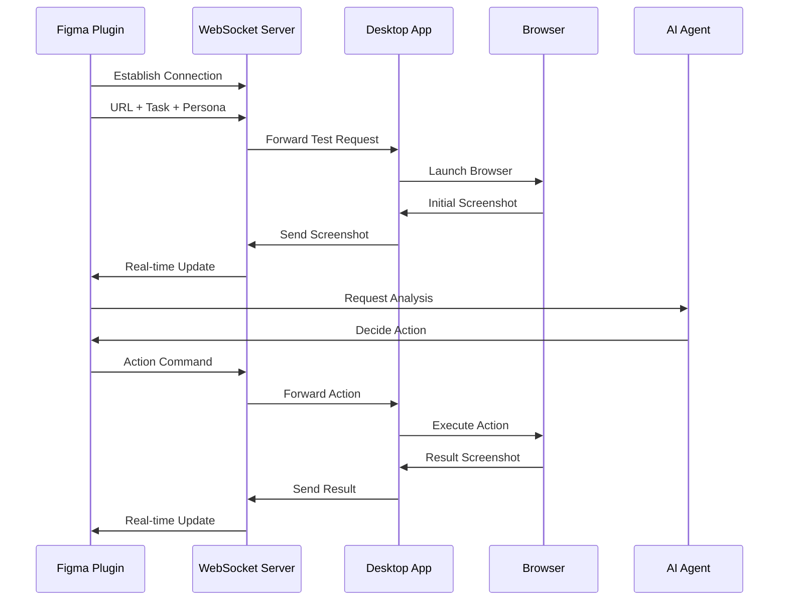

# KleverDesktop

A desktop application that integrates with Figma plugins in real-time, performing AI-based web browser automation testing and visualizing results.

## System Architecture

### Core Components
1. **WebSocket Server**
   - Real-time bidirectional communication with Figma plugin
   - Receives test commands and transmits results in real-time
   - Port: 8080 (default)

2. **Browser Controller**
   - Chrome browser control through Selenium WebDriver
   - Screenshot capture and image processing
   - Mouse/keyboard event simulation

3. **Monitoring UI**
   - Server status monitoring
   - Real-time test progress display
   - Basic settings management (port, browser options, etc.)

### Communication Flow


## Key Features

1. **Real-time Communication**
   - WebSocket-based bidirectional communication
   - Event-driven message handling
   - Automatic reconnection mechanism

2. **Browser Automation**
   - Chrome browser control
   - Screenshot capture
   - User interaction simulation

3. **Monitoring & Settings**
   - Server status monitoring
   - Real-time log viewing
   - Basic settings management

## Tech Stack
- Kotlin (JVM 17)
- Java-WebSocket
- Selenium WebDriver
- JavaFX (Monitoring UI)
- Jackson (JSON processing)
- Gradle (Build tool)

## Development Environment Setup
1. Install JDK 17 or higher
2. Install Chrome browser and ChromeDriver
3. Install Gradle 8.x

## Build and Run
```bash
# Build project
./gradlew build

# Run application
./gradlew run
```

## Configuration Options
- The following can be configured in `config.json`:
  - WebSocket server port
  - Browser options
  - Screenshot save path
  - Log level

## License
MIT License