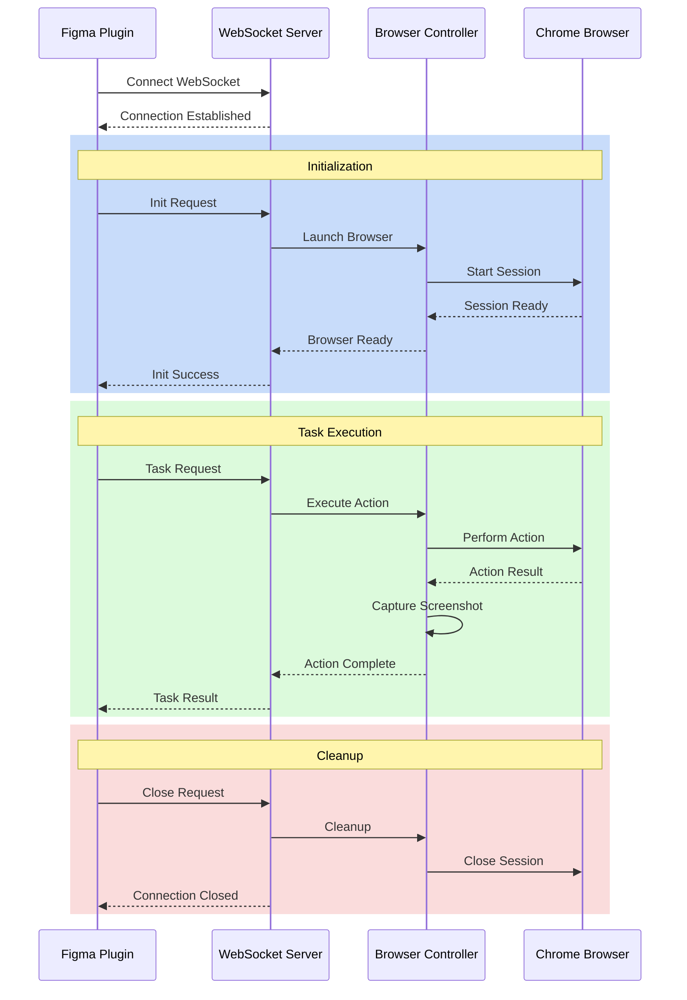

# KleverDesktop

A WebSocket server application that integrates with Figma plugins, providing browser automation capabilities through Selenium WebDriver.

## Key Features

- **Real-time WebSocket Server**: Bidirectional communication with Figma plugin
- **Browser Automation**: Chrome browser control via Selenium WebDriver
- **Screenshot Management**: Capture and process browser screenshots
- **Action Simulation**: Mouse and keyboard event simulation

## Project Structure
```
KleverDesktop/
├── app/                    # Main application
│   ├── src/               # Source files
│   │   └── main/kotlin/   # Kotlin source code
│   └── User_Data/         # Chrome user data
├── figma-client/          # Figma plugin (submodule)
│   └── ...
└── config/               # Configuration files
```

## Getting Started

1. **Prerequisites**
   - JDK 17 or higher
   - Chrome browser and ChromeDriver
   - Gradle 8.x

2. **Installation**
   ```bash
   # Clone repository with submodules
   git clone --recursive [repository-url]
   
   # Build project
   ./gradlew build
   ```

3. **Running the Server**
   ```bash
   ./gradlew run
   ```

## System Architecture

### Core Components
1. **WebSocket Server**
   - Handles plugin communication
   - Manages browser control requests
   - Default port: 8080

2. **Browser Controller**
   - Selenium WebDriver integration
   - Screenshot capture
   - Action execution

3. **Configuration Management**
   - Server settings
   - Browser options
   - Screenshot handling

### Communication Flow



## Configuration

Edit `config.json` to configure:
- WebSocket server port
- Browser options
- Screenshot save path
- Log level

## Development

- Written in Kotlin
- Uses Java-WebSocket for real-time communication
- Selenium WebDriver for browser control
- Jackson for JSON processing
- Gradle for build management

## Git Configuration

- `.gitignore`: Excludes build outputs, IDE files, and user data
- `.gitattributes`: Manages line endings for cross-platform compatibility
- `.gitmodules`: Includes Figma client as a submodule

## License

MIT License