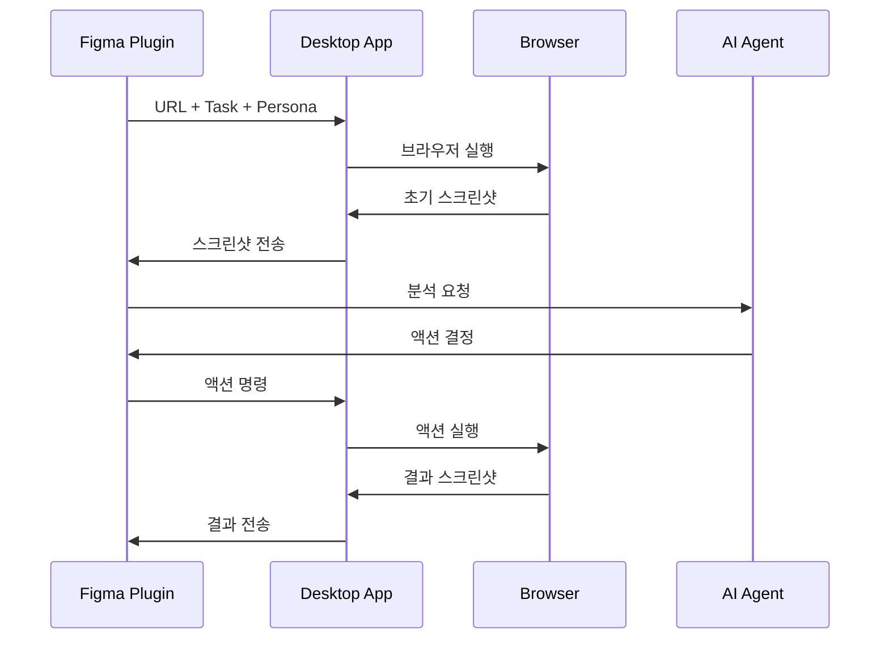

# KleverDesktop

Figma 플러그인과 연동되는 데스크톱 애플리케이션으로, 웹 브라우저 자동화 테스트를 수행하고 결과를 시각화하는 도구입니다.

## 시스템 아키텍처

### 통신 흐름



## 프로젝트 구조

```
KleverDesktop/
├── app/                                # 메인 애플리케이션 모듈
│   ├── build.gradle.kts                # 앱 모듈 빌드 설정
│   └── src/
│       ├── main/
│       │   └── kotlin/
│       │       └── com/
│       │           └── klever/
│       │               └── desktop/
│       │                   ├── App.kt              # 메인 애플리케이션
│       │                   ├── websocket/          # WebSocket 관련 클래스
│       │                   ├── browser/            # Selenium 브라우저 제어
│       │                   ├── ui/                 # JavaFX UI 컴포넌트
│       │                   └── utils/              # 유틸리티 클래스
│       └── test/
│           └── kotlin/
│               └── com/
│                   └── klever/
│                       └── desktop/
│                           └── AppTest.kt          # 테스트 클래스
├── build.gradle.kts                    # 루트 프로젝트 빌드 설정
└── settings.gradle.kts                 # Gradle 설정
```

이 구조는 우리가 구현할 주요 기능들을 명확하게 보여줍니다:
- `websocket/`: Figma 플러그인과의 통신
- `browser/`: Selenium을 이용한 브라우저 제어
- `ui/`: JavaFX 기반의 사용자 인터페이스
- `utils/`: 공통 유틸리티 기능

## 주요 기능
1. **WebSocket 서버**
   - Figma 플러그인과의 실시간 통신
   - 테스트 명령 수신 및 결과 전송

2. **브라우저 자동화**
   - Selenium을 이용한 웹 브라우저 제어
   - 스크린샷 캡처 및 전송
   - 자동화된 사용자 인터랙션

3. **데이터 처리**
   - URL 및 프롬프트 처리
   - 페르소나 기반 테스트 실행
   - AI 에이전트와의 통신

## 기술 스택
- Kotlin
- JavaFX (UI 프레임워크)
- Selenium WebDriver
- Java-WebSocket
- Jackson (JSON 처리)
- Gradle (빌드 도구)

## 개발 환경 설정
1. **필수 요구사항**
   - JDK 17 이상
   - Kotlin 1.9.x
   - Gradle 8.x

2. **프로젝트 실행**

```bash
# Gradle 래퍼 실행 권한 부여
chmod +x gradlew

# 프로젝트 빌드
./gradlew build

# 프로젝트 실행
./gradlew run
```

## 개발 로드맵
1. **Phase 1: 기본 기능 구현**
   - [x] 프로젝트 구조 설정
   - [ ] WebSocket 서버 구현
   - [ ] 기본 UI 레이아웃

2. **Phase 2: 브라우저 자동화**
   - [ ] Selenium 설정
   - [ ] 브라우저 제어 기능
   - [ ] 스크린샷 기능

3. **Phase 3: Figma 연동**
   - [ ] 플러그인 통신 프로토콜
   - [ ] 데이터 교환 구현
   - [ ] 결과 시각화

## 라이선스
MIT License