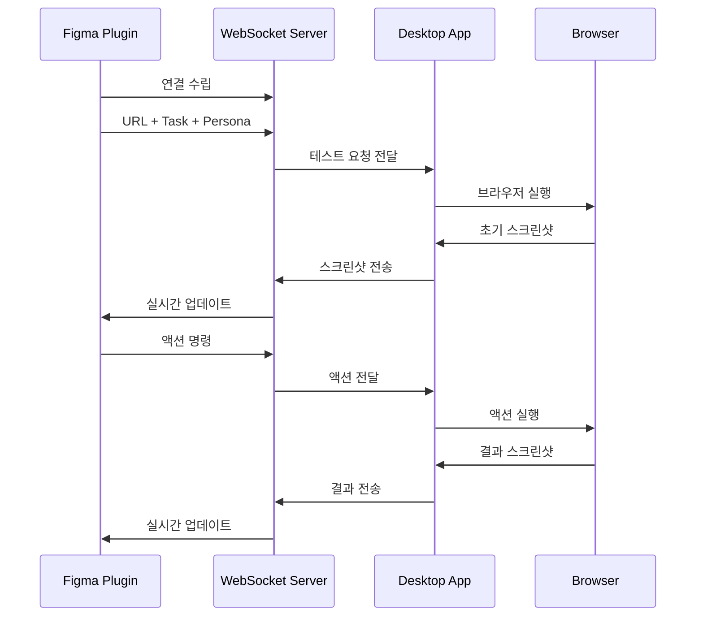

# KleverDesktop

Figma 플러그인과 연동되는 WebSocket 서버 애플리케이션으로, Selenium WebDriver를 통한 브라우저 자동화 기능을 제공합니다.

## 시스템 아키텍처

### 핵심 컴포넌트
1. **WebSocket 서버**
   - Figma 플러그인과 실시간 양방향 통신
   - 테스트 명령 수신 및 결과 전송
   - 기본 포트: 8080

2. **브라우저 컨트롤러**
   - Selenium WebDriver를 통한 Chrome 브라우저 제어
   - 스크린샷 캡처 및 이미지 처리
   - 마우스/키보드 이벤트 시뮬레이션

### 통신 흐름



## 프로젝트 구조

```
KleverDesktop/
├── app/
│   ├── src/main/kotlin/com/klever/desktop/
│   │   ├── App.kt                  # 메인 애플리케이션 (JavaFX 제거 필요)
│   │   ├── server/                 # WebSocket 서버 구현
│   │   │   ├── KleverServer.kt     # 비어있음
│   │   │   └── handlers/           
│   │   │       └── MessageHandler.kt # 비어있음
│   │   ├── browser/                
│   │   │   ├── SeleniumController.kt # 구현됨
│   │   │   └── BrowserActions.kt    # 비어있음
│   │   ├── config/                 
│   │   │   └── AppConfig.kt        # 구현됨
│   │   └── utils/                  # 유틸리티
│   └── resources/
│       └── config/
│           └── config.json         # 비어있음
```

## 주요 기능

1. **실시간 통신**
   - WebSocket 기반 양방향 통신
   - 이벤트 기반 메시지 처리
   - 자동 재연결 메커니즘

2. **브라우저 자동화**
   - Selenium을 통한 Chrome 브라우저 제어
   - 스크린샷 캡처 및 전송
   - 사용자 인터랙션 시뮬레이션

## 기술 스택
- Kotlin (JVM 17)
- Java-WebSocket
- Selenium WebDriver
- Jackson (JSON 처리)
- Gradle (빌드 도구)

## 개발 환경 설정
1. **필수 요구사항**
   - JDK 17 이상
   - Chrome 브라우저 및 ChromeDriver
   - Gradle 8.x

2. **빌드 및 실행**
```bash
# 프로젝트 빌드
./gradlew build

# 애플리케이션 실행
./gradlew run
```

## 설정
`config.json`에서 다음 항목 설정 가능:
- WebSocket 서버 포트 (기본값: 8080)
- 브라우저 옵션
- 스크린샷 저장 경로
- 로그 레벨

## 개발 로드맵
1. **Phase 1: 핵심 기능 구현**
   - [x] 프로젝트 구조 설정
   - [ ] WebSocket 서버 구현
   - [ ] 기본 메시지 처리

2. **Phase 2: 브라우저 자동화**
   - [ ] Selenium 설정
   - [ ] 브라우저 제어 구현
   - [ ] 스크린샷 기능

3. **Phase 3: 통합**
   - [ ] Figma 플러그인 통신 프로토콜
   - [ ] 데이터 교환 구현
   - [ ] 오류 처리 및 복구

## 라이선스
MIT License