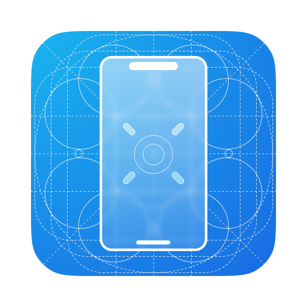

<div align="center">
  

  # Klever Desktop

  **AI-Powered UI Automation for Android & Web**

  [](LICENSE)
  [](https://www.electronjs.org/)
  [](https://reactjs.org/)
  [](https://www.typescriptlang.org/)
  [](https://www.python.org/)

  [Features](#-features) • [Quick Start](#-quick-start) • [Documentation](#-documentation) • [Contributing](#-contributing)

</div>

---

## 🌟 Overview

**Klever Desktop** is a powerful, cross-platform desktop application that brings AI-powered automation to your fingertips. Built on Electron, it enables automated UI exploration and testing for both Android apps and web applications using cutting-edge local AI models (via Ollama) or cloud-based APIs.

Whether you're a QA engineer automating test scenarios, a developer exploring UI behavior, or a researcher studying app interactions, Klever Desktop provides an intuitive interface to create, manage, and monitor automation projects with real-time feedback.

### ✨ Why Klever Desktop?

- 🤖 **Local-First AI**: Run completely offline using Ollama - no API costs, no data sharing
- 🎯 **Multi-Platform**: Seamlessly automate Android devices (ADB) and web browsers (Playwright)
- 📊 **Real-Time Insights**: Live logs, screenshots, and system monitoring as automation runs
- 📝 **Comprehensive Reports**: Auto-generated markdown reports with screenshots and action history
- 🎨 **Modern UI**: Beautiful, responsive interface built with MUI Joy and Framer Motion
- 🔧 **Developer-Friendly**: Full TypeScript support, modular architecture, extensible design

---

## 🚀 Features

<table>
  <tr>
    <td width="50%">

### 🛠️ **Smart Setup Wizard**
Automatic detection and configuration of:
- Python 3.11+ bundled runtime
- Ollama or API models
- ADB for Android automation
- Playwright for web automation
- Simplified environment setup

### 📱 **Android Automation**
- Connect via ADB to real devices/emulators
- Automated UI exploration and testing
- Screenshot capture and analysis
- Touch/swipe gesture simulation
- App state monitoring

### 🌐 **Web Automation**
- Chromium-based browser control
- Cross-browser compatibility
- Responsive design testing
- Form interaction and validation
- JavaScript execution

    </td>
    <td width="50%">

### 🧠 **AI Model Support**
**Local Models (Ollama):**
- qwen3-vl:4b (recommended for 16GB RAM)
- qwen2.5-vl:7b (for 24GB+ RAM)
- llava:7b and more

**Cloud APIs:**
- OpenAI (GPT-4V, GPT-4O)
- OpenRouter (multiple models)
- Anthropic, Grok, and more
- Any OpenAI-compatible API

### 📊 **Project Management**
- Create unlimited automation projects
- Organize by platform (Android/Web)
- Task-based workflow system
- Workspace isolation
- Import/export capabilities

### 📈 **Monitoring & Reports**
- Real-time terminal output
- Live screenshot preview
- System resource tracking
- Markdown report generation
- Action history with timestamps

    </td>
  </tr>
</table>

---

## 🏗️ Tech Stack

<div align="center">

| Layer | Technologies |
|-------|-------------|
| **Frontend** | React 18 • TypeScript 5 • MUI Joy • Framer Motion |
| **Desktop** | Electron 31 • Vite 5 • IPC Communication |
| **Backend** | Python 3.11+ • AppAgent (monorepo) |
| **Automation** | ADB (Android) • Playwright (Web) |
| **AI** | Ollama (local) • OpenAI API • OpenRouter |
| **Build** | Vite • TypeScript • ESLint • Electron Builder |

</div>

---

## ⚡ Quick Start

### Prerequisites

Before you begin, ensure you have the following installed:

- **Node.js** 18+ ([Download](https://nodejs.org/))
- **Python** 3.11+ ([Download](https://www.python.org/downloads/))
- **Ollama** (optional, for local AI) ([Download](https://ollama.com/download))
- **Android Studio** (optional, for Android automation) ([Download](https://developer.android.com/studio))

### Installation

#### 1️⃣ Clone the Repository

```bash
git clone https://github.com/FigmaAI/KleverDesktop.git
cd KleverDesktop
```

#### 2️⃣ Install Dependencies

```bash
# Install Node.js dependencies
npm install

# Set up bundled Python runtime (for development)
node scripts/build-python.js

# Or use system Python (create symlink for development)
mkdir -p resources/python/linux-x64/python/bin
ln -s $(which python3) resources/python/linux-x64/python/bin/python3

# Install Python dependencies (if using system Python)
python3 -m pip install -r appagent/requirements.txt
python3 -m playwright install chromium
```

#### 3️⃣ Set Up Ollama (Optional)

```bash
# Install Ollama from https://ollama.com/download

# Pull recommended model (16GB RAM)
ollama pull qwen3-vl:4b

# Or for 24GB+ RAM
ollama pull qwen2.5-vl:7b
```

#### 4️⃣ Launch the Application

```bash
# Development mode (hot reload)
npm run electron:dev

# Or run separately
npm run dev        # Terminal 1: Vite dev server
npm run electron   # Terminal 2: Electron app
```

The app will launch and guide you through the setup wizard on first run! 🎉

---

## 📖 Documentation

### Development

#### Available Scripts

**Development:**
```bash
npm run electron:dev    # Full dev environment (Vite + Electron with hot reload)
npm run dev            # Vite dev server only (http://localhost:5173)
npm run electron       # Electron only (requires Vite running separately)
```

**Build & Package:**
```bash
npm run build          # Build both main and renderer processes
npm run build:main     # Build Electron main process → dist-electron/
npm run build:renderer # Build React app → dist/
npm run package        # Package Electron app for distribution
```

**Python Bundling (New):**
```bash
node scripts/build-python.js    # Download & setup Python 3.11.9 runtime
node scripts/verify-bundle.js   # Verify all required files before packaging
node scripts/fetch-appagent.js  # Update appagent code (optional)
```

**Linting:**
```bash
npm run lint           # Check for linting errors
npm run lint:fix       # Auto-fix linting errors
```

### Project Structure

```
KleverDesktop/
├── src/                          # React frontend
│   ├── main.tsx                  # React entry point
│   ├── App.tsx                   # Router configuration
│   ├── components/               # 23+ reusable UI components
│   │   ├── Layout.tsx            # Main app shell
│   │   ├── SetupStepper.tsx      # Setup wizard navigation
│   │   ├── ProjectCard.tsx       # Project list item
│   │   ├── TaskCard.tsx          # Task list item
│   │   └── ...                   # Model, platform, settings components
│   ├── pages/                    # Route pages
│   │   ├── SetupWizard.tsx       # First-time setup (343 lines)
│   │   ├── ProjectList.tsx       # Project management
│   │   ├── ProjectDetail.tsx     # Project execution & monitoring
│   │   ├── ProjectCreate.tsx     # Project creation wizard
│   │   └── Settings.tsx          # App configuration
│   ├── hooks/                    # Custom React hooks
│   │   ├── usePlatformTools.tsx  # Platform tools checking
│   │   ├── useModelConfig.tsx    # Model configuration state
│   │   ├── useIntegrationTest.tsx# Integration test logic
│   │   └── useSettings.tsx       # Settings management
│   ├── types/                    # TypeScript definitions
│   │   ├── electron.d.ts         # IPC method signatures (70+ methods)
│   │   ├── project.ts            # Project & Task types
│   │   └── setupWizard.ts        # Setup wizard types
│   └── assets/                   # Images and static files
│       └── logo.png              # App logo
│
├── main/                         # Electron main process
│   ├── index.ts                  # Entry point, window creation
│   ├── preload.ts                # IPC bridge (70+ methods)
│   ├── handlers/                 # IPC handlers (2,041 lines total)
│   │   ├── index.ts              # Central registration
│   │   ├── task.ts               # Task CRUD & execution (452 lines)
│   │   ├── installations.ts      # Environment setup (196 lines)
│   │   ├── project.ts            # Project CRUD (268 lines)
│   │   ├── model.ts              # Model testing & API (243 lines)
│   │   ├── system-checks.ts      # System verification (220 lines)
│   │   ├── integration.ts        # Integration tests (209 lines)
│   │   ├── config.ts             # Config management (131 lines)
│   │   └── ...                   # Utilities, Ollama, dialogs
│   └── utils/                    # Helper modules
│       ├── config-manager.ts     # YAML config management
│       ├── project-storage.ts    # JSON project storage
│       ├── python-runtime.ts     # Bundled Python runtime management
│       └── process-manager.ts    # Subprocess tracking
│
├── appagent/                     # Python automation backend (monorepo)
│   ├── scripts/
│   │   ├── self_explorer.py      # Main automation loop
│   │   ├── and_controller.py     # Android ADB controller
│   │   ├── web_controller.py     # Web Playwright controller
│   │   └── model.py              # AI model integration
│   ├── config.yaml               # Runtime configuration (auto-generated)
│   └── requirements.txt          # Python dependencies
│
├── vite.config.ts                # Vite build configuration
├── package.json                  # Node dependencies & scripts
├── tsconfig.json                 # TypeScript configuration
├── CLAUDE.md                     # AI assistant guide (comprehensive)
└── README.md                     # This file
```

### Configuration

The application stores configuration in `appagent/config.yaml`:

```yaml
# Model Configuration
MODEL: "local"              # "local" (Ollama) or "api" (Cloud)
LOCAL_BASE_URL: "http://localhost:11434/v1/chat/completions"
LOCAL_MODEL: "qwen3-vl:4b"
API_BASE_URL: "https://api.openai.com/v1/chat/completions"
API_KEY: "your-api-key"
API_MODEL: "gpt-4o-mini"

# Model Parameters
MAX_TOKENS: 4096
TEMPERATURE: 0.0

# Android Settings
ANDROID_SCREENSHOT_DIR: "/sdcard"

# Web Settings
WEB_BROWSER_TYPE: "chromium"
WEB_HEADLESS: false
WEB_VIEWPORT_WIDTH: 1280
WEB_VIEWPORT_HEIGHT: 720

# Agent Settings
MAX_ROUNDS: 20
ENABLE_REFLECTION: true
```

User data is stored in:
- **macOS**: `~/Library/Application Support/klever-desktop/`
- **Linux**: `~/.klever-desktop/`
- **Windows**: `%APPDATA%\klever-desktop\`

---

## 🎯 Usage Guide

### 1. First Launch - Setup Wizard

On first launch, you'll be guided through a 3-step setup:

**Step 0: Platform Tools Check**
- Verifies Python 3.11+ installation
- Checks virtual environment and packages
- Validates ADB (for Android) or Playwright (for Web)

**Step 1: Model Configuration**
- Choose Local (Ollama) or API models
- Test connection and fetch available models
- Configure model parameters

**Step 2: Integration Test**
- Run a quick test to verify everything works
- See real-time output in terminal
- Confirm successful setup

### 2. Creating a Project

1. Navigate to **Projects** page
2. Click **New Project**
3. Enter project details:
   - **Name**: Your project name
   - **Platform**: Android or Web
   - **Device/URL**: Select Android device or enter web URL
4. Click **Create Project**

### 3. Adding Tasks

1. Open a project from the project list
2. Click **New Task**
3. Enter task details:
   - **Name**: Task name
   - **Description**: What the AI should do
4. Click **Create Task**

### 4. Running Automation

1. Click **Start Task** on any task
2. Monitor real-time output in the terminal
3. View screenshots as they're captured
4. Wait for completion or click **Stop** to cancel
5. Click **View Report** to see the markdown report

### 5. Managing Settings

Navigate to **Settings** to configure:
- **Model Settings**: Change AI model or provider
- **Platform Settings**: Update Android/Web configurations
- **Agent Settings**: Adjust automation parameters
- **Image Settings**: Configure screenshot handling

---

## 🖥️ System Requirements

### Minimum Requirements

- **OS**: macOS 10.15+, Windows 10+, or Linux (Ubuntu 20.04+)
- **RAM**: 8GB (16GB recommended for local AI)
- **Storage**: 5GB free space
- **CPU**: Multi-core processor (4+ cores recommended)

### Recommended for Best Performance

- **RAM**: 16GB+ (for qwen3-vl:4b)
- **RAM**: 24GB+ (for qwen2.5-vl:7b or llava:7b)
- **GPU**: Optional, but improves Ollama performance
- **SSD**: For faster model loading and screenshot storage

### Platform-Specific Requirements

**For Android Automation:**
- Android Studio (provides ADB)
- USB debugging enabled on Android device
- Android 8.0+ (API level 26+)

**For Web Automation:**
- Chromium browser (auto-installed via Playwright)
- Modern web browsers for testing

---

## 🤝 Contributing

We welcome contributions from the community! Whether it's bug fixes, new features, documentation improvements, or feedback, your help is appreciated.

### How to Contribute

1. **Fork the repository**
2. **Create a feature branch** (`git checkout -b feature/amazing-feature`)
3. **Make your changes** and commit (`git commit -m 'Add amazing feature'`)
4. **Push to your branch** (`git push origin feature/amazing-feature`)
5. **Open a Pull Request**

### Development Guidelines

- Follow the existing code style (ESLint configuration)
- Write TypeScript with strict type checking
- Add comments for complex logic
- Update documentation for new features
- Test changes in both dev and production builds

### Reporting Issues

Found a bug or have a feature request? Please [open an issue](https://github.com/FigmaAI/KleverDesktop/issues) with:
- Clear description of the problem/suggestion
- Steps to reproduce (for bugs)
- Expected vs actual behavior
- System information (OS, Node version, etc.)

---

## License

MIT License - see [LICENSE](LICENSE) for details

---

## 🙏 Acknowledgments

Klever Desktop stands on the shoulders of giants. Special thanks to:

- **[AppAgent](https://github.com/FigmaAI/appagent)** - The powerful Python automation engine that powers our backend
- **[Ollama](https://ollama.com/)** - Making local AI models accessible to everyone
- **[Electron](https://www.electronjs.org/)** - Cross-platform desktop application framework
- **[React](https://reactjs.org/)** & **[TypeScript](https://www.typescriptlang.org/)** - Modern frontend development
- **[MUI Joy](https://mui.com/joy-ui/)** - Beautiful, accessible UI components
- **[Playwright](https://playwright.dev/)** - Reliable web automation
- **[Vite](https://vitejs.dev/)** - Lightning-fast build tool

---

<div align="center">

  **Made with ❤️ by the [FigmaAI](https://github.com/FigmaAI) team**

  ⭐ If you find Klever Desktop useful, please consider giving it a star on GitHub! ⭐

  [⬆ Back to Top](#klever-desktop)

</div>
