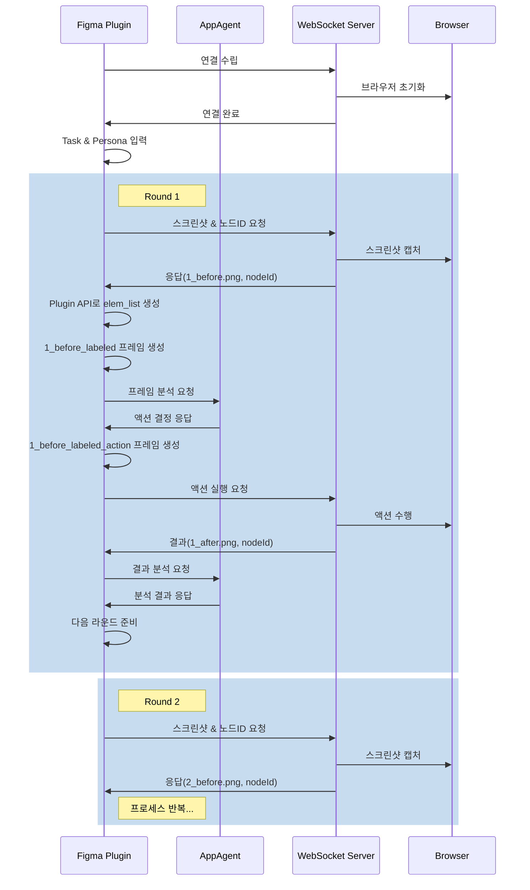

# KleverDesktop

Figma 플러그인과 연동되는 WebSocket 서버 애플리케이션으로, Selenium WebDriver를 통한 브라우저 자동화 기능을 제공합니다.

## 시스템 아키텍처

### 핵심 컴포넌트
1. **Figma 플러그인**
   - AppAgent와의 통신 및 분석 요청 처리
   - 프레임 생성 및 어노테이션
   - Plugin API를 통한 노드 데이터 처리
   - 리포트 생성 및 관리

2. **WebSocket 서버**
   - 브라우저 제어 및 스크린샷 생성
   - 액션 실행 요청 처리
   - 기본 포트: 8080

3. **브라우저 컨트롤러**
   - Selenium WebDriver를 통한 Chrome 브라우저 제어
   - 스크린샷 캡처 및 이미지 처리
   - 마우스/키보드 이벤트 시뮬레이션

### 통신 흐름



## 프로젝트 구조
```
KleverDesktop/
├── app/                    # WebSocket 서버 애플리케이션
│   └── src/main/kotlin/...
├── figma-client/          # Figma 플러그인
│   ├── src/
│   │   ├── app/          # 플러그인 UI 및 로직
│   │   ├── utils/        # 유틸리티 함수
│   │   └── hooks/        # 커스텀 훅
│   └── manifest.json
└── README.md
```

## 기술 스택
- Kotlin (JVM 17)
- Java-WebSocket
- Selenium WebDriver
- Jackson (JSON 처리)
- Gradle (빌드 도구)

## 개발 환경 설정
1. **필수 요구사항**
   - JDK 17 이상
   - Chrome 브라우저 및 ChromeDriver
   - Gradle 8.x

2. **빌드 및 실행**
```bash
# 프로젝트 빌드
./gradlew build

# 애플리케이션 실행
./gradlew run
```

## 설정
`config.json`에서 다음 항목 설정 가능:
- WebSocket 서버 포트 (기본값: 8080)
- 브라우저 옵션
- 스크린샷 저장 경로
- 로그 레벨

## 개발 로드맵

1. **Phase 1: 기반 시스템 구축** ✅
   - [x] 프로젝트 구조 설정
   - [x] 기본 아키텍처 설계
   - [x] 컴포넌트 역할 정의
   - [x] 통신 프로토콜 설계

2. **Phase 2: WebSocket 서버 개발** 🚧
   - [x] WebSocket 서버 구현
   - [x] 브라우저 컨트롤러 연동
   - [ ] 스크린샷 캡처 및 전송
   - [ ] 액션 실행 핸들러
   - [ ] 에러 처리 및 복구

3. **Phase 3: Figma 플러그인 개발** 🚧
   - [x] 플러그인 기본 구조
   - [x] WebSocket 클라이언트 구현
   - [ ] Plugin API 통합
   - [ ] 프레임 생성 및 어노테이션
   - [ ] UI/UX 구현

4. **Phase 4: AI 통합**
   - [ ] AppAgent 통신 프로토콜
   - [ ] 프레임 분석 로직
   - [ ] 액션 결정 알고리즘
   - [ ] 결과 평가 시스템

5. **Phase 5: 테스트 및 최적화**
   - [ ] 통합 테스트
   - [ ] 성능 최적화
   - [ ] 에러 처리 개선
   - [ ] 사용자 피드백 반영

6. **Phase 6: 문서화 및 배포**
   - [ ] API 문서 작성
   - [ ] 사용자 가이드 작성
   - [ ] 배포 프로세스 구축
   - [ ] 유지보수 계획 수립

> 범례:
> - ✅ 완료
> - 🚧 진행 중
> - ⏳ 대기 중

## 라이선스
MIT License

## Appendix: 아키텍처 개선사항

### 기존 방식의 한계
1. **비효율적인 데이터 처리**
   - Figma REST API를 통한 전체 프로젝트 파일(data.json) 다운로드
   - 수십/수백 MB 크기의 불필요한 데이터 전송
   - Python 백엔드에서의 복잡한 노드 데이터 처리

2. **중앙 집중식 처리의 한계**
   - 서버가 AI 통신, 브라우저 제어, 리포트 생성 등 모든 작업 담당
   - 높은 서버 부하 및 처리 지연
   - Figma Plugin API의 장점을 활용하지 못함

### 개선된 기능
1. **효율적인 데이터 처리**
   - 필요한 노드 정보만 실시간 조회
   - Figma Plugin API 활용으로 데이터 접근 최적화
   - 서버 부하 최소화

2. **분산 처리 구조**
   - 각 컴포넌트별 명확한 역할 분담
   - 플러그인의 UI 조작 기능 활용
   - 실시간 프레임 생성 및 분석

3. **향상된 사용자 경험**
   - 빠른 응답 시간
   - 실시간 피드백
   - 리소스 사용 최적화