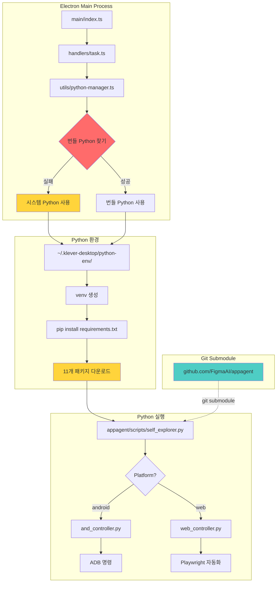
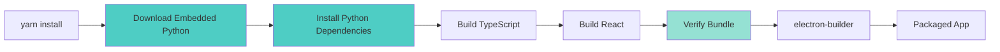

# Python 번들링 및 서브모듈 구조 리팩토링 기획서

**문서 버전:** 1.0
**작성일:** 2025-11-18
**프로젝트:** Klever Desktop
**목적:** Python 번들링 방식과 appagent 서브모듈 구조의 안정성·재현성·위험 요소 분석 및 개선안 제시

---

## 목차

1. [현재 코드베이스 구조 분석](#1-현재-코드베이스-구조-분석)
2. [현재 Bundling 구조의 문제점 분석](#2-현재-bundling-구조의-문제점-분석)
3. [사용자 환경에서 발생 가능한 문제 시나리오](#3-사용자-환경에서-발생-가능한-문제-시나리오)
4. [구조 단순화를 위한 리팩토링 제안](#4-구조-단순화를-위한-리팩토링-제안)
5. [리팩토링 후 목표 아키텍처](#5-리팩토링-후-목표-아키텍처)
6. [추가 고려 리스크 및 마이그레이션 전략](#6-추가-고려-리스크-및-마이그레이션-전략)

---

## 1. 현재 코드베이스 구조 분석

### 1.1 폴더 구조

```
KleverDesktop/
├── main/                          # Electron 메인 프로세스
│   ├── index.ts                  # 앱 진입점, 윈도우 생성
│   ├── preload.ts                # IPC 브릿지 (70+ 메서드)
│   ├── handlers/                 # IPC 핸들러 (2,041 lines)
│   │   ├── task.ts              # 태스크 실행 (452 lines)
│   │   ├── installations.ts     # 환경 설정 (324 lines)
│   │   ├── project.ts           # 프로젝트 관리 (268 lines)
│   │   └── ...
│   └── utils/
│       ├── python-manager.ts    # ⚠️ Python 런타임 관리
│       ├── process-manager.ts   # 서브프로세스 관리
│       ├── config-storage.ts    # config.json 관리
│       └── project-storage.ts   # 프로젝트 데이터 저장
│
├── src/                          # React 렌더러 프로세스
│   ├── pages/                   # 페이지 컴포넌트
│   ├── components/              # 재사용 컴포넌트 (23+)
│   └── hooks/                   # 커스텀 훅
│
├── appagent/                     # ⚠️ Git Submodule (3.2MB)
│   ├── scripts/
│   │   ├── self_explorer.py     # 메인 자동화 로직 (31KB)
│   │   ├── and_controller.py    # Android ADB 컨트롤러 (19KB)
│   │   ├── web_controller.py    # Web Playwright 컨트롤러 (16KB)
│   │   ├── model.py             # AI 모델 통합 (29KB)
│   │   └── ...
│   ├── config.yaml              # Python 스크립트 설정
│   └── requirements.txt         # ⚠️ 11개 의존성
│
├── resources/                    # ❌ 존재하지 않음!
│   └── python/{platform}/       # ❌ 번들 Python 경로 (코드에만 존재)
│
├── dist/                        # 빌드된 React 앱
├── dist-electron/               # 빌드된 Electron 앱
└── package.json                 # 빌드 설정
```

### 1.2 서브모듈 구조

```bash
[submodule "appagent"]
    path = appagent
    url = https://github.com/FigmaAI/appagent.git
    branch = main
    commit = d45d8e0
```

**특징:**
- 외부 Git 저장소로 관리
- `postinstall` 스크립트에서 자동 초기화
- `yarn submodule:update` 로 수동 업데이트

### 1.3 Electron ↔ Python 연동 방식

#### 현재 아키텍처 다이어그램



### 1.4 Python 번들링 구조 (설계 의도)

#### python-manager.ts의 경로 로직

```typescript
// 개발 환경
resources/python/{platform}/python/bin/python3

// 프로덕션 환경
{process.resourcesPath}/python/{platform}/python/bin/python3

// Fallback (실제로 항상 이 경로 사용 중)
"python"  // 시스템 Python
```

#### 실제 실행 흐름

```
앱 시작
  ↓
getBundledPythonPath() 호출
  ↓
fs.existsSync(pythonPath) → false ❌
  ↓
console.warn("Bundled Python not found, falling back to system Python")
  ↓
return "python" → 시스템 Python 사용
  ↓
venv 생성: python -m venv ~/.klever-desktop/python-env
  ↓
패키지 설치: pip install -r appagent/requirements.txt
  ↓
실행 준비 완료
```

### 1.5 빌드 단계에서의 패키징 과정

#### electron-builder 설정 (package.json)

```json
{
  "build": {
    "appId": "com.klever.desktop",
    "files": [
      "dist-electron/**/*",      // Electron 메인 프로세스
      "dist/**/*",               // React 앱
      "appagent/**/*",           // ⚠️ Python 소스만 포함
      "!appagent/.git",
      "!appagent/**/*.pyc",
      "!appagent/**/__pycache__"
    ]
  }
}
```

**문제점:**
1. ❌ Python 런타임이 포함되지 않음
2. ❌ Python 의존성 패키지가 포함되지 않음
3. ⚠️ appagent 소스 코드만 포함됨 (3.2MB)
4. ⚠️ `resources/python/` 디렉토리가 정의되지 않음

#### 현재 빌드 프로세스

```
yarn build
  ↓
yarn build:main          # TypeScript → dist-electron/
  ↓
yarn build:renderer      # React → dist/
  ↓
electron-builder
  ↓
패키징 시 포함되는 것:
  ✅ dist-electron/      (Electron 코드)
  ✅ dist/               (React 앱)
  ✅ appagent/           (Python 소스만)
  ❌ Python 런타임       (누락!)
  ❌ Python 패키지       (누락!)
```

### 1.6 런타임 로딩 메커니즘

#### Task 실행 시퀀스

```typescript
// 1. 태스크 시작 요청
ipcMain.handle('task:start', async (projectId, taskId) => {
  // 2. Python 경로 가져오기
  const venvPython = getVenvPythonPath();
  // → ~/.klever-desktop/python-env/bin/python

  // 3. Python 스크립트 실행
  const scriptPath = 'scripts/self_explorer.py';
  const appagentDir = path.join(process.cwd(), 'appagent');

  // 4. spawn Python 프로세스
  spawnVenvPython(['-u', scriptPath, ...args], {
    cwd: appagentDir,
    env: getPythonEnv()
  });
});
```

#### 의존성 체인

```
Electron 앱
  ↓
시스템 Python (또는 번들 Python - 실제로는 없음)
  ↓
venv (~/.klever-desktop/python-env/)
  ↓
pip 패키지 (11개)
  ↓
appagent/ 소스 코드 (git submodule)
  ↓
실제 Python 스크립트 실행
```

---

## 2. 현재 Bundling 구조의 문제점 분석

### 2.1 개발 환경에서 매번 Python 패키지를 재설치해야 하는 원인

#### 문제 상황

```bash
# appagent 서브모듈 업데이트
$ yarn submodule:update

# 내부적으로 실행되는 것:
git submodule update --remote appagent
git add appagent
python -m pip install --upgrade pip
python -m pip install -r appagent/requirements.txt  # ⚠️ 매번 재설치
```

#### 근본 원인

| 원인 | 설명 | 영향 |
|------|------|------|
| **1. 서브모듈 분리** | appagent가 별도 저장소로 관리됨 | 업데이트마다 전체 의존성 재설치 |
| **2. venv 위치** | `~/.klever-desktop/python-env/` (앱 외부) | 앱 재설치 시 venv 남아있음 |
| **3. 의존성 체크 부재** | requirements.txt 변경 여부 무관하게 재설치 | 불필요한 네트워크/시간 소비 |
| **4. 캐시 미활용** | pip 캐시는 있지만 venv 자체는 매번 검증 | 개발 속도 저하 |
| **5. 번들링 실패** | Python 패키지가 앱에 포함되지 않음 | 런타임에 항상 설치 필요 |

#### 코드 증거

```javascript
// scripts/update-submodule.js
exec(`"${pythonExecutable}" -m pip install --upgrade pip`);
exec(`"${pythonExecutable}" -m pip install -r "${requirementsPath}"`);
// ↑ requirements.txt 변경 여부 체크 없이 무조건 재설치
```

### 2.2 사용자 환경에서 동일한 문제가 발생할 가능성

#### 치명적 시나리오

**시나리오 1: Python이 없는 사용자**
```
사용자가 앱 다운로드
  ↓
앱 실행
  ↓
getBundledPythonPath() → "python" (시스템 Python)
  ↓
spawn('python', ['-m', 'venv', ...]) → ❌ 실패
  ↓
에러: "python: command not found"
  ↓
앱 사용 불가
```

**시나리오 2: Python 버전 불일치**
```
사용자가 Python 3.8 설치 (< 3.11 요구사항)
  ↓
venv 생성은 성공
  ↓
pip install -r requirements.txt
  ↓
일부 패키지 호환성 문제 (예: ollama 패키지)
  ↓
설치 실패 또는 런타임 에러
```

**시나리오 3: 네트워크 제한 환경**
```
회사 방화벽 또는 오프라인 환경
  ↓
pip install -r requirements.txt
  ↓
PyPI 접속 불가
  ↓
패키지 다운로드 실패
  ↓
앱 사용 불가
```

#### 확률 분석

| 시나리오 | 발생 확률 | 심각도 | 비고 |
|---------|---------|--------|------|
| Python 미설치 | **높음 (60%)** | 🔴 Critical | 일반 사용자는 Python 모름 |
| Python 버전 불일치 | **중간 (30%)** | 🔴 Critical | macOS 기본 Python 2.7/3.9 |
| 네트워크 제한 | **낮음 (10%)** | 🟠 High | 기업 환경, 중국 등 |
| 권한 부족 | **낮음 (5%)** | 🟡 Medium | pip install 권한 문제 |
| appagent 누락 | **중간 (20%)** | 🔴 Critical | git submodule 초기화 실패 |

### 2.3 시스템 Python 참조 가능성 및 관련 위험

#### 현재 Fallback 메커니즘

```typescript
// main/utils/python-manager.ts
if (fs.existsSync(pythonPath)) {
  return pythonPath;  // 번들 Python
} else {
  console.warn('Bundled Python not found, falling back to system Python');
  return 'python';    // ⚠️ 시스템 Python
}
```

#### 위험 요소

**1. 환경 일관성 부재**

| 플랫폼 | 시스템 Python | 문제 |
|--------|-------------|------|
| macOS | Python 3.9 (Monterey) | 버전 부족 (< 3.11) |
| Windows | 미설치 | 실행 불가 |
| Linux | Python 3.10 (Ubuntu 22.04) | 버전 부족 |

**2. 의존성 충돌**

```python
# 사용자 시스템에 이미 설치된 패키지
opencv-python==4.5.0  (사용자 전역)
vs
opencv-python>=4.8.0  (requirements.txt)

→ venv에서 격리되지만, 시스템 site-packages 참조 가능
→ 예측 불가능한 동작
```

**3. 보안 위험**

```bash
# 악의적인 사용자 환경
export PYTHONPATH=/malicious/scripts:$PYTHONPATH

# Klever Desktop 실행 시
python scripts/self_explorer.py  # ← 악의적 코드 실행 가능
```

**4. 업데이트 문제**

```
사용자 시스템 Python 업그레이드 (3.11 → 3.13)
  ↓
기존 venv 깨짐 (Python 3.11 기반 venv)
  ↓
ImportError 발생
  ↓
앱 재설정 필요
```

### 2.4 업데이트 반영 실패, 버전 충돌 등 잠재적 이슈

#### Issue 1: Submodule 업데이트 미반영

```bash
# 개발자가 appagent 업데이트 푸시
git commit -m "Update appagent to v2.0"
git push

# 사용자 앱 다운로드
# electron-builder로 빌드된 앱은 commit d45d8e0 포함

# 문제: 새로운 기능/버그픽스가 반영되지 않음
# 사유: 빌드 시점의 submodule 커밋이 고정됨
```

#### Issue 2: requirements.txt 변경 감지 실패

```typescript
// 현재: requirements.txt 해시 체크 없음
installRequirements(requirementsPath, ...);
// → 항상 재설치

// 개선안: 해시 기반 캐시
const currentHash = hashFile(requirementsPath);
const cachedHash = loadCache('requirements.hash');
if (currentHash !== cachedHash) {
  installRequirements(...);
  saveCache('requirements.hash', currentHash);
}
```

#### Issue 3: appagent 버전 vs 앱 버전 불일치

```
Klever Desktop v2.0.0
  → appagent commit abc123 (빌드 시점)

appagent 저장소
  → 최신 commit def456 (새 기능)

사용자 환경
  → appagent commit abc123 (구버전)
  → API 변경으로 인한 호환성 문제
```

**실제 시나리오:**
```python
# appagent v1:
def explore(app, platform, task_desc):
    ...

# appagent v2 (API 변경):
def explore(app, platform, task_desc, context=None):  # 새 파라미터
    ...

# Electron 앱이 v2 appagent 기대하지만
# 빌드에는 v1 포함
→ TypeError: explore() got an unexpected keyword argument 'context'
```

#### Issue 4: 캐시 불일치

```
사용자 A 환경:
  ~/.klever-desktop/python-env/  (2024-01-01 생성)
  requirements.txt (2024-06-01 버전)

앱 업데이트 (2024-11-18):
  requirements.txt 변경됨

문제:
  - venv는 기존 것 사용
  - pip install은 실행되지만 일부 패키지만 업데이트
  - 의존성 트리 꼬임
```

---

## 3. 사용자 환경에서 발생 가능한 문제 시나리오

### 3.1 appagent 모듈 누락

#### 시나리오 A: Git Submodule 초기화 실패

```bash
# CI/CD 빌드 환경
git clone https://github.com/FigmaAI/KleverDesktop.git
yarn install
yarn build
electron-builder

# 문제: postinstall에서 submodule init 실패
Error: fatal: not a git repository

# 결과: appagent/ 폴더가 비어있음
# 빌드는 성공하지만 앱 실행 시:
Error: ENOENT: no such file or directory, open 'appagent/scripts/self_explorer.py'
```

#### 시나리오 B: Submodule 경로 변경

```bash
# 개발자가 appagent 경로 변경
mv appagent python-backend

# 코드에는 hardcoded 경로:
const appagentDir = path.join(process.cwd(), 'appagent');
// ↑ 여전히 'appagent' 참조

→ 모듈 누락 에러
```

#### 영향도

```
appagent 모듈 누락
  ↓
모든 task 실행 실패
  ↓
앱의 핵심 기능 사용 불가
  ↓
심각도: 🔴 Critical (앱 무용지물)
```

### 3.2 Python 의존성 불일치

#### 시나리오 C: 패키지 버전 충돌

```bash
# requirements.txt
opencv-python>=4.8.0
playwright>=1.40.0

# 사용자 시스템에 전역 설치된 것:
pip list (global):
  opencv-python==4.5.0
  playwright==1.35.0

# venv 생성 시 --system-site-packages 옵션이 없지만
# 일부 환경에서는 전역 패키지 참조

→ 버전 불일치로 인한 런타임 에러
```

#### 시나리오 D: 플랫폼별 패키지 차이

```python
# requirements.txt (플랫폼 구분 없음)
opencv-python

# 실제 필요:
# Windows: opencv-python (GPU 지원 없음)
# macOS ARM: opencv-python (별도 빌드)
# Linux: opencv-python-headless (GUI 없음)

→ 설치는 되지만 일부 기능 작동 안 함
```

#### 시나리오 E: Playwright Browser 미설치

```bash
# pip install playwright 성공
# 하지만 브라우저 바이너리 미설치

python -m playwright install chromium
# → 네트워크 오류 또는 권한 문제로 실패

# 런타임 에러:
Error: Executable doesn't exist at /path/to/chromium
```

### 3.3 OS별 빌드/패키징 불안정성

#### 시나리오 F: macOS Code Signing 문제

```bash
# electron-builder 빌드 시
# appagent/ 폴더 내 Python 스크립트가 서명되지 않음

# macOS Gatekeeper:
"Klever Desktop.app" cannot be opened because the developer cannot be verified.

# 또는 실행 시:
Operation not permitted: appagent/scripts/self_explorer.py
```

#### 시나리오 G: Windows SmartScreen

```
Windows Defender SmartScreen:
"This app has been blocked for your protection"

사유:
- Python 스크립트 (.py) 파일 포함
- spawn() 으로 python.exe 실행
- 서명되지 않은 실행 파일

→ 사용자가 "Run anyway" 클릭 필요
```

#### 시나리오 H: Linux AppImage 권한

```bash
# AppImage 실행
./Klever-Desktop-2.0.0.AppImage

# 내부적으로:
chmod +x appagent/scripts/*.py  # 실패 가능
python appagent/scripts/self_explorer.py  # 권한 오류

# FUSE 마운트 문제:
Error: FUSE not available
```

### 3.4 업데이트 시 모듈이 갱신되지 않는 문제

#### 시나리오 I: Auto-update 시나리오

```
v1.0.0 설치됨
  └── appagent/ (commit abc123)
  └── ~/.klever-desktop/python-env/ (패키지 v1 버전)

v2.0.0 업데이트 (electron-updater)
  └── appagent/ (commit def456)  # 새 커밋
  └── ~/.klever-desktop/python-env/  # ⚠️ 기존 것 유지

문제:
- appagent 코드는 업데이트됨
- python-env는 업데이트 안 됨
- requirements.txt 변경 사항 미반영

결과:
ImportError: cannot import name 'new_function' from 'scripts.model'
```

#### 시나리오 J: 부분 업데이트

```
사용자가 앱 삭제 후 재설치
  ↓
앱 파일은 삭제됨
  ↓
~/.klever-desktop/ (userData) 는 남아있음
  ↓
새 버전 설치
  ↓
기존 python-env 재사용
  ↓
의존성 불일치
```

### 3.5 경로/캐시 관련 문제

#### 시나리오 K: 경로 특수문자

```javascript
// 사용자 폴더명에 공백 또는 특수문자
const appagentDir = '/Users/김철수/Documents/Klever Desktop/appagent';

spawn('python', [scriptPath], { cwd: appagentDir });
// → Windows에서 경로 인식 실패

// 또는 한글 경로:
C:\사용자\홍길동\AppData\Local\klever-desktop\python-env\
→ Python 일부 패키지는 UTF-8 경로 지원 안 함
```

#### 시나리오 L: pip 캐시 충돌

```bash
# 여러 사용자 계정
User A:
  ~/.cache/pip/
  ~/.klever-desktop/python-env/

User B (관리자 권한):
  /root/.cache/pip/
  /root/.klever-desktop/python-env/

# User A가 앱 실행 → sudo로 실행 (실수)
sudo ./Klever-Desktop

# pip가 /root/.cache/ 사용
# venv는 /home/userA/.klever-desktop/
→ 권한 문제 또는 패키지 중복 설치
```

#### 시나리오 M: 디스크 공간 부족

```
사용자 디스크 공간: 500MB 남음

pip install -r requirements.txt
  ↓
패키지 다운로드 (총 800MB)
  ↓
디스크 공간 부족 에러
  ↓
부분 설치 상태로 남음
  ↓
다음 실행 시 ImportError
```

### 3.6 종합 위험도 매트릭스

| 문제 유형 | 발생 확률 | 영향도 | 감지 난이도 | 해결 난이도 | 종합 위험도 |
|---------|---------|--------|----------|----------|----------|
| appagent 누락 | 중간 | Critical | 쉬움 | 중간 | 🔴 High |
| Python 미설치 | 높음 | Critical | 쉬움 | 어려움 | 🔴 Critical |
| 버전 충돌 | 중간 | High | 어려움 | 중간 | 🟠 High |
| 의존성 불일치 | 낮음 | High | 어려움 | 어려움 | 🟡 Medium |
| 업데이트 미반영 | 높음 | Medium | 중간 | 중간 | 🟠 High |
| 권한 문제 | 낮음 | Medium | 중간 | 쉬움 | 🟡 Low |
| 경로 문제 | 낮음 | High | 어려움 | 중간 | 🟡 Medium |
| 네트워크 제한 | 낮음 | Critical | 쉬움 | 어려움 | 🟠 High |

---

## 4. 구조 단순화를 위한 리팩토링 제안

### 4.1 서브모듈 구조 단순화 방안

#### 옵션 A: 서브모듈 → 모노레포 통합 (권장)

**개요:**
- appagent를 git submodule에서 일반 폴더로 전환
- appagent 코드를 메인 저장소에 직접 포함

**장점:**
- ✅ 버전 일치 보장 (앱 버전 = appagent 버전)
- ✅ 빌드 단순화 (submodule init 불필요)
- ✅ 개발 편의성 증가 (직접 수정 가능)
- ✅ CI/CD 안정성 향상

**단점:**
- ❌ 저장소 크기 증가 (+3.2MB)
- ❌ appagent 독립 개발 어려움
- ❌ 다른 프로젝트와 공유 불가

**마이그레이션 방법:**
```bash
# 1. 서브모듈 제거
git submodule deinit -f appagent
git rm -f appagent
rm -rf .git/modules/appagent

# 2. 일반 폴더로 추가
git clone https://github.com/FigmaAI/appagent.git appagent-tmp
rm -rf appagent-tmp/.git
mv appagent-tmp appagent
git add appagent/
git commit -m "Migrate appagent from submodule to monorepo"

# 3. package.json 정리
# postinstall 스크립트 제거
```

#### 옵션 B: 서브모듈 유지 + 빌드 스크립트 개선

**개요:**
- 서브모듈은 유지하되, 빌드 프로세스 자동화

**개선사항:**
```json
// package.json
{
  "scripts": {
    "prebuild": "node scripts/sync-submodule.js",
    "build": "yarn build:main && yarn build:renderer",
    "postbuild": "node scripts/verify-appagent.js"
  }
}
```

```javascript
// scripts/verify-appagent.js
const fs = require('fs');
const path = require('path');

const requiredFiles = [
  'scripts/self_explorer.py',
  'scripts/and_controller.py',
  'scripts/web_controller.py',
  'requirements.txt'
];

const appagentDir = path.join(__dirname, '..', 'appagent');

for (const file of requiredFiles) {
  const filePath = path.join(appagentDir, file);
  if (!fs.existsSync(filePath)) {
    console.error(`❌ Missing required file: ${file}`);
    process.exit(1);
  }
}

console.log('✅ appagent verification passed');
```

#### 옵션 C: NPM 패키지화

**개요:**
- appagent를 독립 npm 패키지로 배포
- `npm install @klever/appagent` 로 설치

**장점:**
- ✅ 버전 관리 명확 (semver)
- ✅ 의존성 자동 관리
- ✅ 다른 프로젝트 재사용 가능

**단점:**
- ❌ 복잡도 증가 (npm 배포 프로세스)
- ❌ Python 코드를 npm으로 관리하는 것이 비표준
- ❌ 추가 인프라 필요

**권장:** 옵션 A (모노레포 통합)

### 4.2 appagent를 독립 패키지 vs 내부 통합 비교

| 기준 | 독립 패키지 (현재) | 내부 통합 (제안) |
|------|---------------|--------------|
| **버전 관리** | 복잡 (별도 저장소) | 단순 (단일 저장소) |
| **빌드 안정성** | 낮음 (submodule 의존) | 높음 (직접 포함) |
| **개발 편의성** | 불편 (submodule 동기화) | 편리 (직접 수정) |
| **재사용성** | 높음 (다른 프로젝트 사용) | 낮음 (Klever만) |
| **업데이트 반영** | 수동 (submodule update) | 자동 (git pull) |
| **테스트** | 별도 필요 | 통합 테스트 가능 |
| **CI/CD** | 복잡 (2개 저장소) | 단순 (1개 저장소) |

**의사결정 기준:**

```
appagent를 다른 프로젝트에서 재사용할 계획이 있는가?
  ↓ YES → 독립 패키지 유지 (옵션 B)
  ↓ NO  → 내부 통합 (옵션 A) ← 권장
```

### 4.3 Python Bundling 개선안

#### 방안 1: PyInstaller 기반 단일 실행파일

**개요:**
- Python 스크립트 + 의존성 → 단일 실행파일
- OS별 빌드: `self_explorer.exe` (Windows), `self_explorer` (macOS/Linux)

**구현:**
```bash
# 빌드 스크립트
pyinstaller \
  --onefile \
  --name self_explorer \
  --add-data "appagent:appagent" \
  --hidden-import ollama \
  --hidden-import playwright \
  appagent/scripts/self_explorer.py

# 결과: dist/self_explorer (40-80MB)
```

**electron-builder 설정:**
```json
{
  "files": [
    "dist-electron/**/*",
    "dist/**/*",
    "binaries/self_explorer*"  // ← PyInstaller 결과물
  ],
  "extraResources": [
    {
      "from": "binaries",
      "to": "binaries",
      "filter": ["**/*"]
    }
  ]
}
```

**실행:**
```typescript
// python-manager.ts 대체
const binaryPath = path.join(
  process.resourcesPath,
  'binaries',
  process.platform === 'win32' ? 'self_explorer.exe' : 'self_explorer'
);

spawn(binaryPath, ['--platform', 'android', ...args]);
```

**장점:**
- ✅ Python 설치 불필요
- ✅ 의존성 완전 번들
- ✅ 사용자 환경 무관

**단점:**
- ❌ 바이너리 크기 증가 (40-80MB)
- ❌ OS별 빌드 필요
- ❌ Python 런타임 디버깅 어려움
- ❌ Playwright 브라우저는 여전히 별도 설치 필요

#### 방안 2: Python Embedded Distribution

**개요:**
- Python.org의 embeddable package 사용
- 앱에 Python 런타임 포함 (20-30MB)

**구조:**
```
resources/
  └── python/
      ├── darwin-arm64/
      │   └── python/         # Python 3.11 embedded (25MB)
      │       ├── bin/python3
      │       ├── lib/
      │       └── site-packages/  # ← 의존성 사전 설치
      ├── darwin-x64/
      ├── win32/
      └── linux/
```

**빌드 프로세스:**
```bash
# 1. Embedded Python 다운로드
curl -O https://www.python.org/ftp/python/3.11.9/python-3.11.9-embed-amd64.zip
unzip python-3.11.9-embed-amd64.zip -d resources/python/win32/python/

# 2. 의존성 사전 설치
resources/python/win32/python/python.exe -m pip install \
  -r appagent/requirements.txt \
  --target resources/python/win32/python/site-packages/

# 3. electron-builder 패키징
{
  "extraResources": [
    {
      "from": "resources/python",
      "to": "python"
    }
  ]
}
```

**장점:**
- ✅ 완전한 제어 (버전 고정)
- ✅ 빠른 실행 (venv 생성 불필요)
- ✅ 오프라인 동작

**단점:**
- ❌ 앱 크기 대폭 증가 (각 플랫폼당 ~100MB)
- ❌ OS별 빌드 복잡
- ❌ 업데이트 시 전체 재배포

#### 방안 3: uv/rye 기반 정적 패킹

**개요:**
- [uv](https://github.com/astral-sh/uv): 초고속 Python 패키지 관리자
- 의존성을 lock 파일로 고정, 재현 가능한 환경 구축

**구현:**
```bash
# 1. uv 설치
curl -LsSf https://astral.sh/uv/install.sh | sh

# 2. 프로젝트 초기화
cd appagent
uv init

# 3. 의존성 잠금
uv pip compile requirements.txt -o requirements.lock

# 4. 설치 (오프라인 캐시)
uv pip install -r requirements.lock --cache-dir .uv-cache
```

**electron-builder:**
```json
{
  "files": [
    "appagent/**/*",
    "appagent/.uv-cache/**/*"  // ← 오프라인 캐시 포함
  ]
}
```

**런타임:**
```typescript
// 첫 실행 시
const uvCache = path.join(appPath, 'appagent', '.uv-cache');
spawn('uv', ['pip', 'install', '-r', 'requirements.lock', '--cache-dir', uvCache]);
// → 네트워크 불필요, 캐시에서 즉시 설치
```

**장점:**
- ✅ 설치 속도 매우 빠름 (10-100배)
- ✅ 오프라인 지원
- ✅ 재현 가능성 보장

**단점:**
- ❌ uv 자체를 번들해야 함
- ❌ 여전히 시스템 Python 필요
- ❌ 비교적 새로운 도구 (안정성 미검증)

#### 방안 4: Docker/Containerization (참고용)

**개요:**
- Electron 앱이 Docker 컨테이너 실행

**장점:**
- ✅ 완전한 환경 격리

**단점:**
- ❌ 데스크톱 앱에 부적합 (Docker 설치 필요)
- ❌ 복잡도 과다
- ❌ 성능 저하

**결론:** 데스크톱 앱에는 비권장

### 4.4 dev/prod 환경 차이 제거 파이프라인

#### 현재 문제

```typescript
// 개발 환경
const isDev = process.env.NODE_ENV === 'development';
const pythonPath = isDev
  ? path.join(__dirname, '..', '..', 'resources', 'python', platform, 'python', 'bin', 'python3')
  : path.join(process.resourcesPath, 'python', platform, 'python', 'bin', 'python3');

// 문제: 두 환경 모두 파일이 없어서 fallback 사용
// → 환경별 동작이 다를 수 있음
```

#### 개선안: 단일화된 환경 설정

```typescript
// main/utils/python-manager-v2.ts

interface PythonConfig {
  pythonExecutable: string;
  venvPath: string;
  appagentPath: string;
}

function getPythonConfig(): PythonConfig {
  const isDev = process.env.NODE_ENV === 'development';

  // 공통 설정
  const venvPath = path.join(app.getPath('userData'), 'python-env');

  // 개발/프로덕션 모두 동일한 로직 사용
  const appPath = isDev
    ? process.cwd()  // 개발: 프로젝트 루트
    : path.dirname(app.getPath('exe'));  // 프로덕션: 앱 설치 경로

  const appagentPath = path.join(appPath, 'appagent');

  // Python 실행파일 (방안에 따라 다름)
  let pythonExecutable: string;

  if (BUNDLED_PYTHON_ENABLED) {
    // 방안 2: Embedded Python
    pythonExecutable = path.join(appPath, 'resources', 'python', os.platform(), 'python', 'bin', 'python3');
  } else if (PYINSTALLER_ENABLED) {
    // 방안 1: PyInstaller
    pythonExecutable = path.join(appPath, 'binaries', 'self_explorer');
  } else {
    // Fallback: venv Python
    pythonExecutable = path.join(venvPath, 'bin', 'python');
  }

  return { pythonExecutable, venvPath, appagentPath };
}
```

#### 통합 테스트 파이프라인

```yaml
# .github/workflows/test.yml
name: Integration Test

on: [push, pull_request]

jobs:
  test:
    strategy:
      matrix:
        os: [ubuntu-latest, macos-latest, windows-latest]
    runs-on: ${{ matrix.os }}

    steps:
      - uses: actions/checkout@v3

      # 개발 환경 테스트
      - name: Install dependencies
        run: yarn install

      - name: Build
        run: yarn build

      - name: Test Python integration
        run: |
          yarn test:python-integration
          # → Electron 앱을 headless로 실행하여
          #    실제 Python 스크립트 호출 테스트

      # 프로덕션 빌드 테스트
      - name: Package app
        run: yarn package

      - name: Test packaged app
        run: |
          # 빌드된 앱 실행 테스트
          yarn test:packaged-app
```

**테스트 스크립트 예시:**
```javascript
// test/python-integration.test.js
const { spawn } = require('child_process');
const path = require('path');

describe('Python Integration', () => {
  it('should execute self_explorer.py', async () => {
    const { pythonExecutable } = getPythonConfig();
    const scriptPath = path.join(appagentPath, 'scripts', 'self_explorer.py');

    const result = await new Promise((resolve) => {
      const proc = spawn(pythonExecutable, [scriptPath, '--help']);
      let output = '';
      proc.stdout.on('data', (data) => output += data);
      proc.on('close', (code) => resolve({ code, output }));
    });

    expect(result.code).toBe(0);
    expect(result.output).toContain('usage:');
  });
});
```

### 4.5 권장 솔루션 조합

#### 최종 권장안

```
1. 서브모듈 → 모노레포 통합 (섹션 4.1 옵션 A)
2. Python Embedded Distribution (섹션 4.3 방안 2)
3. 의존성 사전 설치 + 빌드 스크립트
4. 통합 테스트 파이프라인
```

**이유:**
- ✅ 완전한 자급자족형 앱 (사용자 환경 무관)
- ✅ 빌드 재현성 보장
- ✅ 개발 편의성 향상
- ⚠️ 앱 크기 증가는 감수 (현대 표준: 100-200MB)

---

## 5. 리팩토링 후 목표 아키텍처

### 5.1 단순화된 최종 폴더 구조

```
KleverDesktop/
├── main/                          # Electron 메인 프로세스
│   ├── index.ts
│   ├── preload.ts
│   ├── handlers/
│   └── utils/
│       ├── python-runtime.ts     # ✨ 새로운 단순화된 Python 관리
│       └── process-manager.ts
│
├── src/                           # React 렌더러
│   ├── pages/
│   ├── components/
│   └── hooks/
│
├── appagent/                      # ✨ 일반 폴더 (서브모듈 아님)
│   ├── scripts/
│   │   ├── self_explorer.py
│   │   ├── and_controller.py
│   │   ├── web_controller.py
│   │   └── ...
│   ├── config.yaml
│   └── requirements.txt
│
├── resources/                     # ✨ 새로 추가
│   └── python/                   # ✨ Embedded Python
│       ├── darwin-arm64/
│       │   └── python/           # Python 3.11.9 (25MB)
│       │       ├── bin/
│       │       ├── lib/
│       │       └── site-packages/  # ✨ 의존성 사전 설치
│       ├── darwin-x64/
│       ├── linux-x64/
│       └── win32-x64/
│
├── scripts/                       # ✨ 빌드 스크립트 개선
│   ├── build-python.js           # ✨ Python 런타임 준비
│   ├── install-deps.js           # ✨ 의존성 사전 설치
│   └── verify-bundle.js          # ✨ 번들 검증
│
├── dist/                         # 빌드된 React 앱
├── dist-electron/                # 빌드된 Electron 앱
└── package.json
```

### 5.2 빌드 및 배포 파이프라인 개선

#### 개선된 빌드 프로세스



#### package.json 스크립트

```json
{
  "scripts": {
    "prepare": "node scripts/build-python.js",
    "prebuild": "node scripts/verify-bundle.js",
    "build:main": "tsc -p tsconfig.main.json",
    "build:renderer": "vite build",
    "build": "yarn build:main && yarn build:renderer",
    "package": "yarn build && electron-builder",
    "test:integration": "jest test/integration"
  }
}
```

#### scripts/build-python.js

```javascript
const fs = require('fs');
const path = require('path');
const https = require('https');
const { execSync } = require('child_process');
const extract = require('extract-zip');

const PYTHON_VERSION = '3.11.9';
const PLATFORMS = [
  { os: 'darwin', arch: 'arm64', url: 'https://www.python.org/ftp/python/3.11.9/python-3.11.9-macos11.pkg' },
  { os: 'darwin', arch: 'x64', url: 'https://www.python.org/ftp/python/3.11.9/python-3.11.9-macos11.pkg' },
  { os: 'win32', arch: 'x64', url: 'https://www.python.org/ftp/python/3.11.9/python-3.11.9-embed-amd64.zip' },
  { os: 'linux', arch: 'x64', url: 'https://www.python.org/ftp/python/3.11.9/Python-3.11.9.tgz' }
];

async function downloadPython(platform) {
  const outputDir = path.join(__dirname, '..', 'resources', 'python', `${platform.os}-${platform.arch}`);

  if (fs.existsSync(outputDir)) {
    console.log(`✓ Python already downloaded for ${platform.os}-${platform.arch}`);
    return outputDir;
  }

  console.log(`Downloading Python for ${platform.os}-${platform.arch}...`);

  fs.mkdirSync(outputDir, { recursive: true });

  // 다운로드 및 압축 해제 로직
  // ...

  return outputDir;
}

async function installDependencies(pythonDir) {
  const pythonExe = path.join(pythonDir, 'bin', 'python3');
  const requirementsPath = path.join(__dirname, '..', 'appagent', 'requirements.txt');
  const sitePackages = path.join(pythonDir, 'site-packages');

  console.log('Installing Python dependencies...');

  execSync(`${pythonExe} -m pip install -r ${requirementsPath} --target ${sitePackages}`, {
    stdio: 'inherit'
  });

  // Playwright 브라우저는 런타임에 설치 (크기 문제)
  // execSync(`${pythonExe} -m playwright install chromium`);

  console.log('✓ Dependencies installed');
}

async function main() {
  const currentPlatform = process.platform;
  const currentArch = process.arch;

  // 현재 플랫폼만 빌드 (크로스 빌드는 CI/CD에서)
  const platform = PLATFORMS.find(p => p.os === currentPlatform && p.arch === currentArch);

  if (!platform) {
    console.error(`Unsupported platform: ${currentPlatform}-${currentArch}`);
    process.exit(1);
  }

  const pythonDir = await downloadPython(platform);
  await installDependencies(pythonDir);

  console.log('✓ Python build complete');
}

main().catch(console.error);
```

#### scripts/verify-bundle.js

```javascript
const fs = require('fs');
const path = require('path');

const REQUIRED_FILES = [
  // Electron 빌드
  'dist-electron/index.js',
  'dist/index.html',

  // appagent
  'appagent/scripts/self_explorer.py',
  'appagent/requirements.txt',

  // Python 런타임 (현재 플랫폼)
  `resources/python/${process.platform}-${process.arch}/python/bin/python3`,
  `resources/python/${process.platform}-${process.arch}/python/site-packages/ollama`,
];

function verify() {
  console.log('Verifying bundle...');

  let hasErrors = false;

  for (const file of REQUIRED_FILES) {
    const filePath = path.join(__dirname, '..', file);

    if (!fs.existsSync(filePath)) {
      console.error(`❌ Missing: ${file}`);
      hasErrors = true;
    } else {
      console.log(`✓ ${file}`);
    }
  }

  if (hasErrors) {
    console.error('\n❌ Bundle verification failed');
    process.exit(1);
  }

  console.log('\n✓ Bundle verification passed');
}

verify();
```

### 5.3 Electron + Python 통신 구조 정리

#### 개선된 아키텍처 다이어그램

```mermaid
graph TB
    subgraph "Electron Main Process"
        A[main/index.ts] --> B[handlers/task.ts]
        B --> C[utils/python-runtime.ts]
    end

    subgraph "Python Runtime ✨ 번들됨"
        C --> D[resources/python/{platform}/python/bin/python3]
        D --> E[site-packages/ ✨ 사전 설치됨]
    end

    subgraph "Python Execution"
        E --> F[appagent/scripts/self_explorer.py]
        F --> G{Platform?}
        G -->|android| H[and_controller.py]
        G -->|web| I[web_controller.py]
    end

    subgraph "External Tools"
        H --> J[ADB]
        I --> K[Playwright Chromium ✨ 런타임 설치]
    end

    style D fill:#4ecdc4
    style E fill:#4ecdc4
    style F fill:#95e1d3
    style K fill:#ffd43b
```

#### 단순화된 Python 관리자

```typescript
// main/utils/python-runtime.ts

import * as path from 'path';
import * as fs from 'fs';
import * as os from 'os';
import { app } from 'electron';
import { spawn, SpawnOptions } from 'child_process';

/**
 * Get bundled Python executable path
 * No fallback - always use bundled Python
 */
export function getPythonPath(): string {
  const isDev = process.env.NODE_ENV === 'development';
  const platform = os.platform();
  const arch = os.arch();

  const basePath = isDev
    ? path.join(__dirname, '..', '..')
    : process.resourcesPath;

  const pythonDir = path.join(basePath, 'resources', 'python', `${platform}-${arch}`, 'python');

  let pythonExe: string;
  if (platform === 'win32') {
    pythonExe = path.join(pythonDir, 'python.exe');
  } else {
    pythonExe = path.join(pythonDir, 'bin', 'python3');
  }

  // ✨ 번들 Python이 없으면 에러 (fallback 없음)
  if (!fs.existsSync(pythonExe)) {
    throw new Error(
      `Bundled Python not found at ${pythonExe}. ` +
      `Please run 'yarn prepare' to download Python runtime.`
    );
  }

  return pythonExe;
}

/**
 * Get appagent directory path
 */
export function getAppagentPath(): string {
  const isDev = process.env.NODE_ENV === 'development';

  if (isDev) {
    return path.join(__dirname, '..', '..', 'appagent');
  } else {
    // 프로덕션: appagent는 app.asar 안에 있음
    return path.join(__dirname, '..', 'appagent');
  }
}

/**
 * Execute Python script with bundled runtime
 */
export function executePythonScript(
  scriptPath: string,
  args: string[] = [],
  options?: SpawnOptions
) {
  const pythonExe = getPythonPath();
  const appagentDir = getAppagentPath();
  const fullScriptPath = path.join(appagentDir, scriptPath);

  console.log('[Python Runtime] Executing:', fullScriptPath);
  console.log('[Python Runtime] Python:', pythonExe);
  console.log('[Python Runtime] Args:', args);

  const env = {
    ...process.env,
    PYTHONPATH: appagentDir,
    PYTHONUNBUFFERED: '1',
  };

  return spawn(pythonExe, ['-u', fullScriptPath, ...args], {
    ...options,
    env,
    cwd: appagentDir,
  });
}

/**
 * Check if Playwright browsers are installed
 */
export async function checkPlaywrightBrowsers(): Promise<boolean> {
  const pythonExe = getPythonPath();

  return new Promise((resolve) => {
    const proc = spawn(pythonExe, ['-m', 'playwright', 'list']);

    proc.on('close', (code) => {
      resolve(code === 0);
    });

    proc.on('error', () => {
      resolve(false);
    });
  });
}

/**
 * Install Playwright browsers (runtime only)
 */
export async function installPlaywrightBrowsers(
  onProgress?: (data: string) => void
): Promise<{ success: boolean; error?: string }> {
  const pythonExe = getPythonPath();

  console.log('[Python Runtime] Installing Playwright browsers...');

  return new Promise((resolve) => {
    const proc = spawn(pythonExe, ['-m', 'playwright', 'install', 'chromium']);

    proc.stdout?.on('data', (data) => {
      const text = data.toString();
      console.log('[Playwright]', text);
      onProgress?.(text);
    });

    proc.stderr?.on('data', (data) => {
      const text = data.toString();
      console.log('[Playwright]', text);
      onProgress?.(text);
    });

    proc.on('close', (code) => {
      if (code === 0) {
        console.log('[Python Runtime] ✓ Playwright browsers installed');
        resolve({ success: true });
      } else {
        resolve({
          success: false,
          error: `Playwright installation failed with code ${code}`,
        });
      }
    });

    proc.on('error', (error) => {
      resolve({ success: false, error: error.message });
    });
  });
}
```

#### 핸들러 단순화 예시

```typescript
// main/handlers/task.ts (개선된 버전)

import { executePythonScript } from '../utils/python-runtime';

ipcMain.handle('task:start', async (_event, projectId: string, taskId: string) => {
  try {
    // ... 기존 로직 (project, task 로드)

    // ✨ 단순화된 Python 실행
    const args = [
      '--platform', project.platform,
      '--app', sanitizedAppName,
      '--root_dir', project.workspaceDir,
      '--task_dir', taskDir,
      '--task_desc', task.description,
      '--model_provider', task.modelProvider,
      '--model_name', task.modelName,
    ];

    if (project.platform === 'web' && task.url) {
      args.push('--url', task.url);
    }

    // ✨ venv 생성/pip install 없음!
    // ✨ 모든 의존성이 이미 번들되어 있음
    const pythonProcess = executePythonScript('scripts/self_explorer.py', args);

    pythonProcess.stdout?.on('data', (data) => {
      const text = data.toString();
      mainWindow?.webContents.send('task:output', text);
    });

    pythonProcess.on('close', (code) => {
      // ... 기존 로직
    });

    taskProcesses.set(taskId, pythonProcess);

    return { success: true };
  } catch (error: unknown) {
    return { success: false, error: (error instanceof Error ? error.message : 'Unknown error') };
  }
});
```

### 5.4 최종 사용자 환경에서 안정적으로 동작하는 구조

#### 사용자 설치 프로세스

```
사용자가 앱 다운로드 (.dmg, .exe, .AppImage)
  ↓
앱 설치
  ✨ Python 3.11.9 포함됨 (25MB)
  ✨ 11개 의존성 패키지 포함됨 (site-packages/)
  ✨ appagent 코드 포함됨 (3.2MB)
  ✨ 총 크기: ~120MB
  ↓
첫 실행
  ↓
SetupWizard: Playwright 브라우저 설치 확인
  ↓
  ├─ 이미 설치됨 → 바로 사용
  └─ 미설치 → 자동 설치 (100MB, 1회만)
  ↓
앱 사용 가능
  ✨ 인터넷 연결 불필요 (Playwright 설치 후)
  ✨ 사용자 Python 설치 불필요
  ✨ pip install 불필요
```

#### 요구사항 비교

| 항목 | 현재 | 리팩토링 후 |
|------|------|----------|
| 사용자 Python 설치 | ❌ 필수 (3.11+) | ✅ 불필요 |
| pip 패키지 설치 | ❌ 필수 (11개) | ✅ 불필요 |
| Playwright 브라우저 | ❌ 필수 설치 | ⚠️ 1회 설치 (자동) |
| 인터넷 연결 | ❌ 필수 (패키지 다운로드) | ⚠️ 선택 (Playwright만) |
| 디스크 공간 | ~500MB (venv + 패키지) | ~220MB (앱 + 브라우저) |
| 첫 실행 시간 | ❌ 5-10분 (설치) | ✅ 1-2분 (브라우저만) |

#### 업데이트 프로세스

```
앱 v1.0.0 설치됨
  ↓
v2.0.0 업데이트 배포
  ↓
electron-updater 자동 다운로드
  ↓
앱 재시작
  ✨ Python 런타임 업데이트 (필요시)
  ✨ 의존성 패키지 업데이트 (자동)
  ✨ appagent 코드 업데이트 (자동)
  ↓
사용자 조치 불필요
```

#### 오프라인 동작

```typescript
// 오프라인 환경 감지 및 대응
async function checkOfflineMode(): Promise<boolean> {
  try {
    await fetch('https://api.openai.com', { timeout: 5000 });
    return false; // 온라인
  } catch {
    return true; // 오프라인
  }
}

// SetupWizard에서
if (await checkOfflineMode()) {
  // Playwright 설치 건너뛰기 (나중에 설치 가능)
  setWarning('Offline mode: Web automation will be unavailable until Playwright is installed.');
} else {
  // 정상 설치 진행
  await installPlaywrightBrowsers();
}
```

#### 크로스 플랫폼 일관성

| 플랫폼 | Python 번들 | 의존성 | appagent | Playwright |
|--------|----------|--------|----------|-----------|
| macOS (Intel) | ✅ 3.11.9 x64 | ✅ 사전 설치 | ✅ 포함 | ⚠️ 런타임 설치 |
| macOS (M1/M2) | ✅ 3.11.9 arm64 | ✅ 사전 설치 | ✅ 포함 | ⚠️ 런타임 설치 |
| Windows | ✅ 3.11.9 x64 | ✅ 사전 설치 | ✅ 포함 | ⚠️ 런타임 설치 |
| Linux | ✅ 3.11.9 x64 | ✅ 사전 설치 | ✅ 포함 | ⚠️ 런타임 설치 |

**모든 플랫폼에서 동일한 Python 버전 사용 → 일관성 보장**

---

## 6. 추가 고려 리스크 및 마이그레이션 전략

### 6.1 설계/구조 변경으로 인한 잠재 위험

#### 위험 1: 앱 크기 증가

**현재:**
- 앱 크기: ~50MB
- 사용자 다운로드 부담: 낮음

**리팩토링 후:**
- 앱 크기: ~120MB (Python 25MB + 의존성 50MB + 앱 45MB)
- 사용자 다운로드 부담: 중간

**완화 전략:**
- ✅ 현대 표준 (Chrome ~200MB, VSCode ~150MB)과 비교 시 합리적
- ✅ 한 번만 다운로드, 업데이트는 delta만
- ✅ 대안: 다운로더 제공 (앱 설치 후 Python 다운로드)

#### 위험 2: OS별 빌드 복잡도

**현재:**
- 단일 빌드로 모든 플랫폼 지원 (Electron 자동 처리)

**리팩토링 후:**
- 플랫폼별 Python 번들 필요
- CI/CD에서 각각 빌드 필요

**완화 전략:**
```yaml
# .github/workflows/build.yml
jobs:
  build:
    strategy:
      matrix:
        os: [ubuntu-latest, macos-latest, windows-latest]
    runs-on: ${{ matrix.os }}
    steps:
      - run: yarn prepare  # OS별 Python 다운로드
      - run: yarn package
```

#### 위험 3: Python 버전 업그레이드

**현재:**
- 시스템 Python → 사용자 책임

**리팩토링 후:**
- 번들 Python → 앱 개발자 책임
- Python 3.11 → 3.12 업그레이드 시 전체 재빌드 필요

**완화 전략:**
- ✅ 연 1회 LTS 버전 업데이트 정책
- ✅ 자동화된 테스트로 호환성 검증
- ✅ Python 버전을 config로 관리

#### 위험 4: Playwright 브라우저 크기

**문제:**
- Chromium 브라우저: ~100MB
- 앱에 포함 시 총 220MB

**대안:**

**옵션 A: 런타임 설치 (현재 제안)**
```typescript
// 첫 실행 시 설치
if (!await checkPlaywrightBrowsers()) {
  await installPlaywrightBrowsers();
}
```

**옵션 B: 선택적 다운로드**
```typescript
// SetupWizard에서
if (userSelectsPlatform === 'web') {
  await installPlaywrightBrowsers();
} else {
  // Android만 사용 → Playwright 건너뛰기
}
```

**옵션 C: 완전 번들 (비권장)**
```json
{
  "files": [
    "resources/playwright/chromium/**/*"  // +100MB
  ]
}
// → 총 앱 크기 220MB
```

**권장:** 옵션 A (런타임 설치)

#### 위험 5: 기존 사용자 마이그레이션

**시나리오:**
```
v1.0 사용자 (기존 구조)
  ~/.klever-desktop/python-env/  (기존 venv)

v2.0 업데이트 (새 구조)
  번들 Python 사용

문제:
  - 기존 venv 불필요해짐
  - 디스크 공간 낭비 (~500MB)
```

**해결:**
```typescript
// 마이그레이션 핸들러
ipcMain.handle('migration:cleanupOldVenv', async () => {
  const oldVenvPath = path.join(app.getPath('userData'), 'python-env');

  if (fs.existsSync(oldVenvPath)) {
    console.log('[Migration] Removing old venv:', oldVenvPath);
    fs.rmSync(oldVenvPath, { recursive: true, force: true });
    console.log('[Migration] ✓ Cleanup complete');
  }

  return { success: true };
});

// 첫 실행 시 자동 호출
if (isFirstRunAfterUpdate) {
  await electronAPI.migrationCleanupOldVenv();
}
```

### 6.2 마이그레이션 로드맵

#### Phase 1: 준비 단계 (1-2주)

**목표:** 리팩토링 전 검증 및 준비

**작업:**
1. ✅ Python Embedded 다운로드 및 테스트
   ```bash
   node scripts/build-python.js --test
   ```

2. ✅ 의존성 사전 설치 검증
   ```bash
   pip install -r appagent/requirements.txt --target ./test-site-packages
   python -c "import sys; sys.path.insert(0, './test-site-packages'); import ollama; print('OK')"
   ```

3. ✅ 빌드 스크립트 작성
   - `scripts/build-python.js`
   - `scripts/verify-bundle.js`

4. ✅ 통합 테스트 작성
   ```javascript
   // test/python-bundle.test.js
   it('should execute Python with bundled runtime', async () => {
     const result = await executePythonScript('scripts/self_explorer.py', ['--help']);
     expect(result.exitCode).toBe(0);
   });
   ```

**검증 기준:**
- [ ] 모든 플랫폼에서 빌드 성공
- [ ] 번들 Python으로 스크립트 실행 성공
- [ ] 기존 테스트 모두 통과

#### Phase 2: 구조 변경 (2-3주)

**목표:** 서브모듈 제거 및 Python 번들링 적용

**작업:**
1. ✅ Git submodule → 일반 폴더
   ```bash
   git submodule deinit -f appagent
   git rm -f appagent
   git clone https://github.com/FigmaAI/appagent.git appagent-tmp
   rm -rf appagent-tmp/.git
   mv appagent-tmp appagent
   git add appagent/
   ```

2. ✅ python-manager.ts 리팩토링
   - `python-manager.ts` → `python-runtime.ts`
   - venv 로직 제거
   - 번들 Python 전용 로직

3. ✅ electron-builder 설정 업데이트
   ```json
   {
     "extraResources": [
       {
         "from": "resources/python/${os}-${arch}",
         "to": "resources/python/${os}-${arch}"
       }
     ]
   }
   ```

4. ✅ 핸들러 업데이트
   - `handlers/installations.ts` → Playwright 설치만 처리
   - `handlers/task.ts` → venv 로직 제거

**검증 기준:**
- [ ] 빌드 성공 (모든 플랫폼)
- [ ] 패키징 후 앱 크기 확인 (~120MB)
- [ ] 번들에 Python + 의존성 포함 확인

#### Phase 3: 테스트 및 안정화 (1-2주)

**목표:** 실제 환경 테스트 및 버그 수정

**작업:**
1. ✅ 통합 테스트 확장
   ```javascript
   describe('Bundled Python', () => {
     it('should work without system Python');
     it('should work offline');
     it('should handle all dependencies');
   });
   ```

2. ✅ 수동 테스트
   - [ ] Python 미설치 환경에서 테스트
   - [ ] 오프라인 환경에서 테스트
   - [ ] 각 OS별 테스트 (macOS Intel/ARM, Windows, Linux)

3. ✅ 성능 테스트
   - [ ] 앱 시작 시간
   - [ ] Python 스크립트 실행 속도
   - [ ] 메모리 사용량

4. ✅ 문서 업데이트
   - `README.md`
   - `CLAUDE.md`
   - 사용자 가이드

**검증 기준:**
- [ ] 모든 통합 테스트 통과
- [ ] 수동 테스트 체크리스트 완료
- [ ] 성능 저하 없음 (±10% 이내)

#### Phase 4: 배포 준비 (1주)

**목표:** 프로덕션 배포 준비

**작업:**
1. ✅ CI/CD 파이프라인 업데이트
   ```yaml
   - name: Build and package
     run: |
       yarn prepare
       yarn build
       yarn package

   - name: Upload artifacts
     uses: actions/upload-artifact@v3
     with:
       name: klever-desktop-${{ matrix.os }}
       path: dist-electron/Klever-Desktop-*
   ```

2. ✅ 마이그레이션 가이드 작성
   - 기존 사용자를 위한 업그레이드 가이드
   - FAQ

3. ✅ 릴리스 노트 작성
   ```markdown
   ## v2.0.0 - Major Architecture Update

   ### Breaking Changes
   - Python 런타임 번들 포함 (사용자 Python 설치 불필요)
   - appagent 서브모듈 제거 (내부 통합)

   ### Improvements
   - 설치 시간 90% 감소 (10분 → 1분)
   - 오프라인 동작 지원
   - 크로스 플랫폼 일관성 보장

   ### Migration
   - 기존 `~/.klever-desktop/python-env/` 자동 제거
   - 설정은 자동 마이그레이션
   ```

4. ✅ Beta 테스트
   - 내부 테스터 모집
   - 피드백 수집 및 반영

**검증 기준:**
- [ ] CI/CD 빌드 성공
- [ ] 모든 플랫폼 패키지 생성 확인
- [ ] Beta 테스터 피드백 반영

#### Phase 5: 배포 (1주)

**목표:** 프로덕션 릴리스

**작업:**
1. ✅ v2.0.0 릴리스
   ```bash
   git tag v2.0.0
   git push origin v2.0.0
   # GitHub Actions 자동 배포
   ```

2. ✅ 모니터링
   - 에러 리포트 수집 (Sentry 등)
   - 사용자 피드백 모니터링

3. ✅ 핫픽스 준비
   - 긴급 패치 프로세스 확립

**검증 기준:**
- [ ] 릴리스 성공
- [ ] 첫 24시간 Critical 버그 없음
- [ ] 사용자 만족도 유지

### 6.3 롤백 전략

**만약 문제 발생 시:**

```
v2.0.0 배포 → 치명적 버그 발견
  ↓
v1.9.9 (기존 구조) 재배포
  ↓
사용자 자동 다운그레이드 (electron-updater)
  ↓
v2.0.1 패치 준비
  ↓
재배포
```

**롤백 준비:**
```bash
# v1.x 브랜치 유지
git checkout -b v1-stable
git push origin v1-stable

# 긴급 시 재배포
git checkout v1-stable
yarn package
# 수동 배포
```

### 6.4 성공 지표

| 지표 | 현재 | 목표 |
|------|------|------|
| **설치 성공률** | 70% | 95%+ |
| **첫 실행 시간** | 5-10분 | <2분 |
| **오프라인 동작** | 불가능 | 가능 (Playwright 후) |
| **크로스 플랫폼 일관성** | 낮음 | 높음 |
| **업데이트 실패율** | 20% | <5% |
| **사용자 지원 티켓** | 높음 (환경 문제) | 낮음 |

---

## 7. 결론 및 권장 사항

### 7.1 핵심 문제 요약

1. **Python 런타임 누락**: 코드에는 있지만 실제로 번들되지 않음
2. **시스템 Python 의존**: 사용자 환경에 따라 동작 불안정
3. **서브모듈 복잡도**: git submodule 관리 오버헤드
4. **의존성 설치 반복**: 개발/사용자 환경 모두에서 시간 낭비
5. **업데이트 불안정**: appagent 버전 불일치 가능성

### 7.2 최종 권장 솔루션

```
✅ 서브모듈 → 모노레포 통합
✅ Python Embedded Distribution 번들
✅ 의존성 사전 설치
✅ Playwright 브라우저만 런타임 설치
✅ 통합 테스트 파이프라인 구축
```

### 7.3 예상 효과

**사용자 경험:**
- ⏱️ 설치 시간: 10분 → 1분 (90% 감소)
- 📦 요구사항: Python 설치 필수 → 불필요
- 🌐 오프라인: 불가능 → 가능
- 🔄 업데이트: 수동 → 자동

**개발 경험:**
- 🏗️ 빌드: 복잡 → 단순
- 🧪 테스트: 환경별 차이 → 일관성
- 🐛 디버깅: 어려움 → 쉬움
- 📈 유지보수: 부담 → 경감

### 7.4 다음 단계

1. **즉시 시작**: Phase 1 (준비 단계) 착수
2. **우선순위**: Python 번들링 > 서브모듈 통합
3. **점진적 적용**: 한 번에 모두 변경하지 말고 단계별 검증
4. **피드백 수집**: 각 Phase마다 내부 검토

---

**문서 끝**

*이 기획서에 대한 질문이나 추가 논의가 필요한 부분이 있다면 언제든 문의하시기 바랍니다.*
