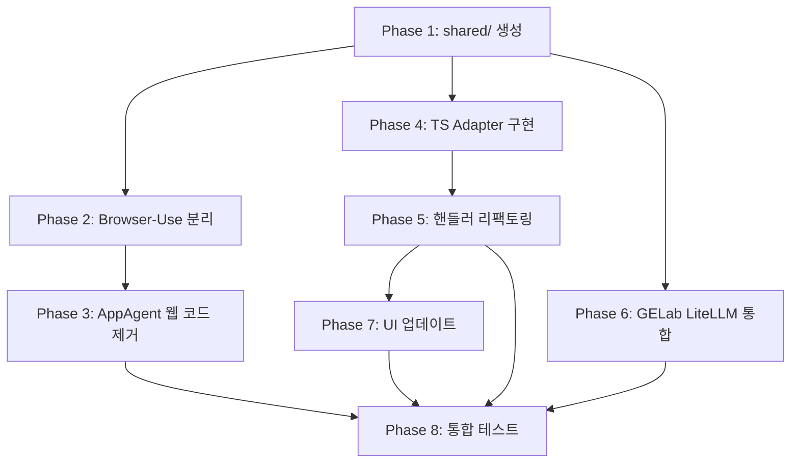

# Multi-Agent Architecture - Final Execution Plan

## 개요

이 문서는 Klever Desktop을 3-Agent 멀티에이전트 아키텍처로 업그레이드하기 위한 **최종 실행 계획서**입니다. `COMMON_MODULES_ANALYSIS.md`와 `MULTI_AGENT_ARCHITECTURE_PLAN.md`의 설계를 바탕으로, 현재 코드베이스 분석 결과를 반영하여 구체적인 구현 단계를 정의합니다.

---

## 목차

1. [현재 상태 분석](#현재-상태-분석)
2. [목표 아키텍처](#목표-아키텍처)
3. [구현 Phase 정의](#구현-phase-정의)
4. [Phase별 상세 작업](#phase별-상세-작업)
5. [파일별 변경 사항](#파일별-변경-사항)
6. [의존성 및 순서](#의존성-및-순서)
7. [테스트 계획](#테스트-계획)
8. [위험 요소 및 대응](#위험-요소-및-대응)

---

## 현재 상태 분석

### 1. 폴더 구조 (현재)

```
agents/
├── requirements.txt           # 통합 의존성 (661 bytes)
├── appagent/                  # AppAgent (Android + Web 혼재)
│   ├── scripts/
│   │   ├── self_explorer.py   # 메인 진입점
│   │   ├── model.py           # LiteLLM 통합 (871줄) ✅
│   │   ├── and_controller.py  # Android 제어
│   │   ├── browser_use_wrapper.py  # Browser-Use 래퍼
│   │   ├── google_login.py    # Web Google 로그인
│   │   ├── utils.py           # 공통 유틸리티
│   │   └── ...
│   └── ...
└── gelab-zero/                # GELab-Zero (Android only)
    ├── klever_wrapper/
    │   ├── self_explorer.py   # 진입점
    │   └── ...
    └── tools/
        └── ask_llm_v2.py      # ❌ 구식 OpenAI SDK
```

### 2. TypeScript 현황

| 파일 | 상태 | 문제점 |
|------|------|--------|
| `main/utils/python-runtime.ts` | 부분 지원 | `getPythonEnv()`가 appagent만 참조 (line 524) |
| `main/handlers/task.ts` | 부분 지원 | 엔진 분기는 있으나 appagent/gelab만 (line 228-247) |
| `main/handlers/google-login.ts` | ❌ 미지원 | appagent 하드코딩 |
| `main/handlers/integration.ts` | ❌ 미지원 | appagent 하드코딩 |
| `main/types/config.ts` | 부분 지원 | `AgentEngine = 'appagent' \| 'gelab'` (browser-use 없음) |

### 3. 핵심 이슈

1. **Browser-Use가 AppAgent 내부에 종속** - 독립 에이전트로 분리 필요
2. **AppAgent가 Android+Web 혼재** - 원래 목적(Android)으로 복귀 필요
3. **공통 모듈 부재** - LLM, 유틸리티, 설정 로더가 중복
4. **GELab이 구식 OpenAI SDK 사용** - LiteLLM 마이그레이션 필요
5. **핸들러들이 appagent 하드코딩** - Adapter 패턴 미적용

---

## 목표 아키텍처

### 3-Agent 구조

```
┌─────────────────────────────────────────────────────────────┐
│                    Electron Main Process                     │
├─────────────────────────────────────────────────────────────┤
│  IPC Handlers                                                │
│  - task.ts, google-login.ts, integration.ts                 │
├─────────────────────────────────────────────────────────────┤
│  Agent Controller (NEW: main/utils/agent-controller.ts)     │
│  - 에이전트 선택 로직                                         │
│  - 플랫폼 검증                                                │
│  - 어댑터 팩토리                                              │
├─────────────────────────────────────────────────────────────┤
│  Agent Adapters (NEW: main/adapters/)                       │
│  - AppAgentAdapter (Android only)                           │
│  - BrowserUseAdapter (Web only)                             │
│  - GelabAdapter (Android only)                              │
└─────────────────┬───────────────────────────────────────────┘
                  │
┌─────────────────▼───────────────────────────────────────────┐
│                    Python Agents Layer                       │
├─────────────────────────────────────────────────────────────┤
│  agents/shared/          # 공통 모듈 (NEW)                   │
│  ├── llm/               # LiteLLM 통합                       │
│  ├── android/           # ADB, 에뮬레이터                    │
│  ├── web/               # Google Login (Web)                │
│  └── utils/             # 이미지, 출력, 설정                  │
├─────────────────────────────────────────────────────────────┤
│  agents/appagent/        # Android 전용 (refactored)        │
│  agents/browser-use/     # Web 전용 (NEW)                   │
│  agents/gelab-zero/      # Android 전용 (LiteLLM 통합)      │
└─────────────────────────────────────────────────────────────┘
```

### 에이전트별 역할

| 에이전트 | 플랫폼 | 특징 | 모델 요구사항 |
|----------|--------|------|--------------|
| **AppAgent** | Android only | 전통적 방식, UI 요소 기반 | Any (LiteLLM) |
| **Browser-Use** | Web only | AI-driven, 비전 기반 | Vision 모델 필수 |
| **GELab-Zero** | Android only | 멀티디바이스 지원 | Any (LiteLLM) |

---

## 구현 Phase 정의

### Phase 0: 준비 작업 (1일)
- [x] 브랜치 생성 및 기획 문서 작성
- [ ] 기존 테스트 실행하여 베이스라인 확보

### Phase 1: 공통 모듈 (agents/shared/) 생성 (2일)
- [ ] 디렉토리 구조 생성
- [ ] LLM 모듈 추출 (appagent/model.py → shared/llm/)
- [ ] 유틸리티 모듈 추출
- [ ] 설정 로더 생성

### Phase 2: Browser-Use 독립 분리 (1일)
- [ ] agents/browser-use/ 디렉토리 생성
- [ ] browser_use_wrapper.py 이동
- [ ] 전용 self_explorer.py 생성

### Phase 3: AppAgent 웹 코드 제거 (0.5일)
- [ ] web_controller.py 관련 코드 제거
- [ ] self_explorer.py에서 web 분기 제거

### Phase 4: TypeScript Adapter 구현 (2일)
- [ ] Agent 타입 정의 (main/types/agent.ts)
- [ ] Adapter 구현 (main/adapters/)
- [ ] Agent Controller 구현 (main/utils/agent-controller.ts)

### Phase 5: 핸들러 리팩토링 (1.5일)
- [ ] task.ts 리팩토링
- [ ] google-login.ts 리팩토링
- [ ] integration.ts 리팩토링

### Phase 6: GELab LiteLLM 통합 (1일)
- [ ] ask_llm_v2.py deprecated 처리
- [ ] shared/llm 사용하도록 마이그레이션

### Phase 7: UI 업데이트 (0.5일)
- [ ] Settings.tsx 에이전트 선택 UI
- [ ] 플랫폼별 권장 에이전트 표시

### Phase 8: 통합 테스트 및 문서화 (1일)
- [ ] 전체 플로우 테스트
- [ ] CLAUDE.md 업데이트
- [ ] README 업데이트

**총 예상 기간: 10-11일**

---

## Phase별 상세 작업

### Phase 1: 공통 모듈 생성

#### 1.1 디렉토리 구조 생성

```bash
mkdir -p agents/shared/{llm,android,web,utils,schemas}
touch agents/shared/__init__.py
touch agents/shared/{llm,android,web,utils,schemas}/__init__.py
```

최종 구조:
```
agents/shared/
├── __init__.py
├── llm/
│   ├── __init__.py
│   ├── base_model.py         # BaseModel 인터페이스
│   ├── litellm_model.py      # LiteLLMModel (OpenAIModel 이동)
│   ├── model_factory.py      # create_model() 팩토리
│   └── utils.py              # Provider 감지, timeout 등
├── android/
│   ├── __init__.py
│   ├── emulator.py           # 에뮬레이터 관리
│   ├── adb_wrapper.py        # ADB 명령 래퍼
│   └── google_login.py       # Android Google 로그인
├── web/
│   ├── __init__.py
│   └── google_login.py       # Web Google 로그인 (Playwright)
├── utils/
│   ├── __init__.py
│   ├── image.py              # encode_image, optimize_image
│   ├── output.py             # print_with_color
│   └── config.py             # 환경 변수 → dict 로더
└── schemas/
    ├── __init__.py
    ├── action.py             # Action 스키마
    └── response.py           # LLM Response 스키마
```

#### 1.2 LLM 모듈 추출

**FROM**: `agents/appagent/scripts/model.py`
**TO**: `agents/shared/llm/`

```python
# agents/shared/llm/base_model.py
from abc import ABC, abstractmethod
from typing import List, Dict, Any, Tuple

class BaseModel(ABC):
    @abstractmethod
    def get_model_response(self, prompt: str, images: List[str]) -> Tuple[bool, str, Dict[str, Any]]:
        pass
```

```python
# agents/shared/llm/litellm_model.py
# OpenAIModel 클래스를 LiteLLMModel로 이름 변경하여 이동
# (코드는 COMMON_MODULES_ANALYSIS.md 참조)
```

```python
# agents/shared/llm/model_factory.py
from .litellm_model import LiteLLMModel

def create_model(
    model_name: str,
    api_key: str = "",
    base_url: str = "",
    temperature: float = 0.0,
    max_tokens: int = 4096,
    configs: dict = None
):
    return LiteLLMModel(
        model=model_name,
        api_key=api_key,
        base_url=base_url,
        temperature=temperature,
        max_tokens=max_tokens,
        configs=configs
    )
```

#### 1.3 유틸리티 모듈 추출

**FROM**: `agents/appagent/scripts/utils.py`
**TO**: `agents/shared/utils/`

```python
# agents/shared/utils/image.py
import base64
from PIL import Image
from io import BytesIO

def encode_image(image_path: str) -> str:
    """이미지를 base64로 인코딩"""
    # (기존 코드 이동)

def optimize_image(image_path: str, max_width=1280, max_height=720, quality=95) -> str:
    """이미지 최적화 (리사이즈 + 압축)"""
    # (기존 코드 이동)
```

```python
# agents/shared/utils/output.py
def print_with_color(text: str, color: str):
    """컬러 출력"""
    colors = {
        "red": "\033[91m",
        "green": "\033[92m",
        "yellow": "\033[93m",
        "blue": "\033[94m",
        "magenta": "\033[95m",
        "cyan": "\033[96m",
        "reset": "\033[0m"
    }
    color_code = colors.get(color, "")
    reset_code = colors["reset"]
    print(f"{color_code}{text}{reset_code}", flush=True)
```

```python
# agents/shared/utils/config.py
import os
from typing import Dict, Any

def load_config() -> Dict[str, Any]:
    """환경 변수에서 설정 로드 (Electron이 주입)"""
    return {
        'MODEL_PROVIDER': os.getenv('MODEL_PROVIDER', 'ollama'),
        'MODEL_NAME': os.getenv('MODEL_NAME', 'ollama/llama3.2-vision'),
        'API_KEY': os.getenv('API_KEY', ''),
        'API_BASE_URL': os.getenv('API_BASE_URL', ''),
        'MAX_TOKENS': int(os.getenv('MAX_TOKENS', '4096')),
        'TEMPERATURE': float(os.getenv('TEMPERATURE', '0.0')),
        'REQUEST_INTERVAL': int(os.getenv('REQUEST_INTERVAL', '10')),
        'MAX_ROUNDS': int(os.getenv('MAX_ROUNDS', '20')),
        'ANDROID_SCREENSHOT_DIR': os.getenv('ANDROID_SCREENSHOT_DIR', '/sdcard'),
        'ANDROID_XML_DIR': os.getenv('ANDROID_XML_DIR', '/sdcard'),
        'WEB_BROWSER_TYPE': os.getenv('WEB_BROWSER_TYPE', 'chromium'),
        'OUTPUT_LANGUAGE': os.getenv('OUTPUT_LANGUAGE', 'en'),
        'ENABLE_REFLECTION': os.getenv('ENABLE_REFLECTION', 'true').lower() == 'true',
    }
```

### Phase 2: Browser-Use 독립 분리

#### 2.1 디렉토리 생성

```bash
mkdir -p agents/browser-use/scripts
```

#### 2.2 파일 이동 및 생성

```
agents/browser-use/
├── scripts/
│   ├── __init__.py
│   ├── self_explorer.py       # 새로 생성 (Web 전용 진입점)
│   └── browser_use_wrapper.py # appagent에서 이동
└── requirements.txt           # browser-use 전용 의존성
```

```python
# agents/browser-use/scripts/self_explorer.py
"""
Browser-Use Agent - Web automation using AI-driven browser control.
Web 플랫폼 전용. Vision 모델 필요 (GPT-4o, Claude 3.5+).
"""
import sys
from pathlib import Path

# agents 루트를 Python path에 추가
agents_root = Path(__file__).parent.parent.parent
sys.path.insert(0, str(agents_root))

from shared.llm.model_factory import create_model
from shared.utils.config import load_config
from shared.utils.output import print_with_color
from browser_use_wrapper import BrowserUseWrapper

def main():
    # 환경 변수에서 설정 로드
    config = load_config()

    # 모델 생성
    model = create_model(
        model_name=config['MODEL_NAME'],
        api_key=config['API_KEY'],
        base_url=config['API_BASE_URL'],
        temperature=config['TEMPERATURE'],
        max_tokens=config['MAX_TOKENS']
    )

    # Browser-Use 실행
    # ... (구현)

if __name__ == "__main__":
    main()
```

### Phase 3: AppAgent 웹 코드 제거

#### 3.1 제거할 파일/코드

- `agents/appagent/scripts/web_controller.py` - 파일 삭제 (있다면)
- `agents/appagent/scripts/self_explorer.py` - `platform == 'web'` 분기 제거

#### 3.2 AppAgent self_explorer.py 수정

```python
# platform 체크 추가
if args.platform == 'web':
    print_with_color("ERROR: AppAgent no longer supports web platform.", "red")
    print_with_color("Please use Browser-Use agent for web automation.", "yellow")
    sys.exit(1)
```

### Phase 4: TypeScript Adapter 구현

#### 4.1 타입 정의

```typescript
// main/types/agent.ts
export type AgentEngineType = 'appagent' | 'browser-use' | 'gelab';
export type PlatformType = 'android' | 'web';

export interface AgentAdapter {
  name: string;
  engineType: AgentEngineType;

  // 경로
  getBasePath(): string;
  getScriptsPath(): string;

  // Task 실행
  getTaskScript(): string;
  buildTaskArgs(project: Project, task: Task, taskDir: string): string[];
  getPythonEnv(baseEnv: NodeJS.ProcessEnv): NodeJS.ProcessEnv;

  // 기능 지원
  supportsGoogleLogin(): boolean;
  supportsIntegrationTest(): boolean;
  supportsPlatform(platform: PlatformType): boolean;

  // 공통 스크립트
  getGoogleLoginScript(): string | null;
  getIntegrationTestScript(): string | null;
  getEmulatorCleanupCode(): string | null;

  // 엔진 특성
  isAIDriven(): boolean;
  requiresHeavyModel(): boolean;
  getRecommendedModel(): string | null;
}
```

#### 4.2 Adapter 구현

```typescript
// main/adapters/appagent-adapter.ts
import { AgentAdapter } from '../types/agent';
import { getAppagentPath, getAgentsPath } from '../utils/python-runtime';
import * as path from 'path';

export class AppAgentAdapter implements AgentAdapter {
  name = 'AppAgent';
  engineType = 'appagent' as const;

  supportsPlatform(platform: 'android' | 'web'): boolean {
    return platform === 'android'; // Android only
  }

  getBasePath(): string {
    return getAppagentPath();
  }

  getScriptsPath(): string {
    return path.join(this.getBasePath(), 'scripts');
  }

  getTaskScript(): string {
    return path.join('scripts', 'self_explorer.py');
  }

  getPythonEnv(baseEnv: NodeJS.ProcessEnv): NodeJS.ProcessEnv {
    const scriptsDir = this.getScriptsPath();
    const workingDir = this.getBasePath();
    const sharedDir = path.join(getAgentsPath(), 'shared');

    return {
      ...baseEnv,
      PYTHONPATH: `${scriptsDir}${path.delimiter}${workingDir}${path.delimiter}${sharedDir}`,
      PYTHONUNBUFFERED: '1',
    };
  }

  // ... 나머지 메서드 구현
}
```

```typescript
// main/adapters/browser-use-adapter.ts
export class BrowserUseAdapter implements AgentAdapter {
  name = 'Browser-Use';
  engineType = 'browser-use' as const;

  supportsPlatform(platform: 'android' | 'web'): boolean {
    return platform === 'web'; // Web only
  }

  isAIDriven(): boolean {
    return true;
  }

  requiresHeavyModel(): boolean {
    return true; // Vision 모델 필수
  }

  getRecommendedModel(): string {
    return 'gpt-4o';
  }

  // ... 나머지 메서드 구현
}
```

```typescript
// main/adapters/gelab-adapter.ts
export class GelabAdapter implements AgentAdapter {
  name = 'GELab-Zero';
  engineType = 'gelab' as const;

  supportsPlatform(platform: 'android' | 'web'): boolean {
    return platform === 'android'; // Android only
  }

  // ... 나머지 메서드 구현
}
```

#### 4.3 Agent Controller 구현

```typescript
// main/utils/agent-controller.ts
import { AgentAdapter, AgentEngineType, PlatformType } from '../types/agent';
import { AppAgentAdapter } from '../adapters/appagent-adapter';
import { BrowserUseAdapter } from '../adapters/browser-use-adapter';
import { GelabAdapter } from '../adapters/gelab-adapter';
import { AppConfig, Project } from '../types';

class AgentController {
  private adapters: Map<AgentEngineType, AgentAdapter> = new Map();

  constructor() {
    this.registerAdapter(new AppAgentAdapter());
    this.registerAdapter(new BrowserUseAdapter());
    this.registerAdapter(new GelabAdapter());
  }

  private registerAdapter(adapter: AgentAdapter): void {
    this.adapters.set(adapter.engineType, adapter);
  }

  getAdapter(engineType: AgentEngineType, platform?: PlatformType): AgentAdapter {
    const adapter = this.adapters.get(engineType);
    if (!adapter) {
      throw new Error(`Agent adapter not found: ${engineType}`);
    }
    if (platform && !adapter.supportsPlatform(platform)) {
      throw new Error(`Agent ${adapter.name} does not support platform: ${platform}`);
    }
    return adapter;
  }

  getAdapterForProject(project: Project, appConfig: AppConfig): AgentAdapter {
    // 자동 에이전트 선택 로직
    const configEngine = appConfig.execution.agentEngine;

    // 플랫폼에 따른 자동 선택
    if (project.platform === 'web') {
      // Web은 browser-use만 지원
      return this.getAdapter('browser-use', 'web');
    }

    // Android는 설정된 엔진 사용 (appagent 또는 gelab)
    return this.getAdapter(configEngine === 'gelab' ? 'gelab' : 'appagent', 'android');
  }

  getCompatibleAdapters(platform: PlatformType): AgentAdapter[] {
    return Array.from(this.adapters.values())
      .filter(adapter => adapter.supportsPlatform(platform));
  }
}

export const agentController = new AgentController();
```

### Phase 5: 핸들러 리팩토링

#### 5.1 task.ts 수정

**변경 전** (line 228-247):
```typescript
const agentEngine = appConfig.execution.agentEngine || 'appagent';

if (agentEngine === 'gelab' && project.platform === 'android') {
  workingDir = getGelabPath();
  scriptPath = path.join('klever_wrapper', 'self_explorer.py');
} else {
  workingDir = getAppagentPath();
  scriptPath = path.join('scripts', 'self_explorer.py');
}
```

**변경 후**:
```typescript
import { agentController } from '../utils/agent-controller';

// 프로젝트에 맞는 어댑터 자동 선택
const adapter = agentController.getAdapterForProject(project, appConfig);

const workingDir = adapter.getBasePath();
const args = ['-u', ...adapter.buildTaskArgs(project, task, taskDir)];
const agentEnv = adapter.getPythonEnv(pythonEnv);

const taskProcess = spawnBundledPython(args, {
  cwd: workingDir,
  env: {
    ...agentEnv,
    ...configEnvVars,
    PATH: updatedPath,
  }
});
```

**에뮬레이터 정리 수정** (line 45-71):
```typescript
async function cleanupEmulatorIfIdle(projectsData): Promise<void> {
  // Android 어댑터 가져오기
  const adapter = agentController.getAdapter('appagent', 'android');
  const cleanupCode = adapter.getEmulatorCleanupCode();

  if (!cleanupCode) {
    return; // 해당 어댑터가 에뮬레이터 정리 미지원
  }

  const cleanupProcess = spawnBundledPython(['-u', '-c', cleanupCode], {
    cwd: adapter.getBasePath(),
    env: adapter.getPythonEnv(getPythonEnv()),
  });
  // ...
}
```

#### 5.2 google-login.ts 수정

```typescript
import { agentController } from '../utils/agent-controller';

ipcMain.handle('google-login:start', async (_event, profileDir, platform: 'web' | 'android') => {
  // 플랫폼에 맞는 어댑터 선택
  const adapters = agentController.getCompatibleAdapters(platform);
  const adapter = adapters.find(a => a.supportsGoogleLogin());

  if (!adapter) {
    return { success: false, error: `No agent supports Google Login for ${platform}` };
  }

  const scriptPath = adapter.getGoogleLoginScript();
  if (!scriptPath) {
    return { success: false, error: `Agent ${adapter.name} does not provide Google Login script` };
  }

  // ... 실행
});
```

#### 5.3 integration.ts 수정

```typescript
import { agentController } from '../utils/agent-controller';

ipcMain.handle('integration:test', async (_event, deviceId: string) => {
  const adapter = agentController.getAdapter('appagent', 'android');

  if (!adapter.supportsIntegrationTest()) {
    return { success: false, error: `Agent ${adapter.name} does not support integration tests` };
  }

  const scriptPath = adapter.getIntegrationTestScript();
  // ... 실행
});
```

### Phase 6: GELab LiteLLM 통합

#### 6.1 ask_llm_v2.py deprecated 처리

```python
# agents/gelab-zero/tools/ask_llm_v2.py
"""
DEPRECATED: Use agents/shared/llm instead.
This module is kept for backward compatibility only.
"""
import warnings
warnings.warn(
    "ask_llm_v2 is deprecated. Use 'from shared.llm.model_factory import create_model' instead.",
    DeprecationWarning,
    stacklevel=2
)

# Redirect to shared module
import sys
from pathlib import Path
agents_root = Path(__file__).parent.parent.parent
sys.path.insert(0, str(agents_root))

from shared.llm.model_factory import create_model
from shared.llm.litellm_model import LiteLLMModel

# Backward compatibility
ask_llm_anything = lambda *args, **kwargs: create_model(*args, **kwargs)
```

#### 6.2 GELab 스크립트 마이그레이션

```python
# agents/gelab-zero/klever_wrapper/self_explorer.py 수정
import sys
from pathlib import Path

# shared 모듈 import 가능하게 설정
agents_root = Path(__file__).parent.parent.parent
sys.path.insert(0, str(agents_root))

# 구식 import 교체
# from tools.ask_llm_v2 import ask_llm_anything  # 삭제
from shared.llm.model_factory import create_model
from shared.utils.config import load_config
```

### Phase 7: UI 업데이트

#### 7.1 config.ts 타입 수정

```typescript
// main/types/config.ts
export type AgentEngine = 'appagent' | 'browser-use' | 'gelab';

export interface ExecutionConfig {
  maxTokens: number;
  temperature: number;
  requestInterval: number;
  maxRounds: number;
  agentEngine: AgentEngine;
  // ... 기타 필드
}
```

#### 7.2 Settings.tsx UI 추가

```tsx
// src/pages/Settings.tsx
<div className="space-y-2">
  <Label htmlFor="agent-engine">Agent Engine</Label>
  <Select
    value={config.execution.agentEngine}
    onValueChange={(value) => updateConfig({
      ...config,
      execution: { ...config.execution, agentEngine: value as AgentEngine }
    })}
  >
    <SelectTrigger id="agent-engine">
      <SelectValue />
    </SelectTrigger>
    <SelectContent>
      <SelectItem value="appagent">
        AppAgent <Badge variant="secondary">Android</Badge>
      </SelectItem>
      <SelectItem value="browser-use">
        Browser-Use <Badge variant="secondary">Web</Badge>
        <Badge variant="default">AI-Driven</Badge>
      </SelectItem>
      <SelectItem value="gelab">
        GELab-Zero <Badge variant="secondary">Android</Badge>
      </SelectItem>
    </SelectContent>
  </Select>

  {config.execution.agentEngine === 'browser-use' && (
    <Alert>
      <AlertTitle>Vision 모델 필요</AlertTitle>
      <AlertDescription>
        권장: GPT-4o, Claude 3.5 Sonnet, Gemini 2.0 Flash
      </AlertDescription>
    </Alert>
  )}
</div>
```

---

## 파일별 변경 사항

### 새로 생성할 파일

| 경로 | 설명 |
|------|------|
| `agents/shared/__init__.py` | shared 패키지 초기화 |
| `agents/shared/llm/*.py` | LLM 모듈 (5개 파일) |
| `agents/shared/android/*.py` | Android 모듈 (3개 파일) |
| `agents/shared/web/*.py` | Web 모듈 (2개 파일) |
| `agents/shared/utils/*.py` | 유틸리티 모듈 (4개 파일) |
| `agents/browser-use/scripts/self_explorer.py` | Browser-Use 진입점 |
| `agents/browser-use/requirements.txt` | Browser-Use 전용 의존성 |
| `main/types/agent.ts` | Agent 타입 정의 |
| `main/adapters/appagent-adapter.ts` | AppAgent 어댑터 |
| `main/adapters/browser-use-adapter.ts` | Browser-Use 어댑터 |
| `main/adapters/gelab-adapter.ts` | GELab 어댑터 |
| `main/adapters/index.ts` | 어댑터 export |
| `main/utils/agent-controller.ts` | 에이전트 컨트롤러 |

### 수정할 파일

| 경로 | 변경 내용 |
|------|-----------|
| `main/handlers/task.ts` | Adapter 패턴 적용 |
| `main/handlers/google-login.ts` | Adapter 패턴 적용 |
| `main/handlers/integration.ts` | Adapter 패턴 적용 |
| `main/utils/python-runtime.ts` | `getBrowserUsePath()` 추가 |
| `main/types/config.ts` | AgentEngine 타입 확장 |
| `src/pages/Settings.tsx` | 에이전트 선택 UI |
| `agents/appagent/scripts/self_explorer.py` | shared 모듈 import |
| `agents/gelab-zero/klever_wrapper/self_explorer.py` | shared 모듈 import |

### 이동할 파일

| FROM | TO |
|------|-----|
| `agents/appagent/scripts/model.py` (일부) | `agents/shared/llm/litellm_model.py` |
| `agents/appagent/scripts/utils.py` (일부) | `agents/shared/utils/` |
| `agents/appagent/scripts/google_login.py` | `agents/shared/web/google_login.py` |
| `agents/appagent/scripts/browser_use_wrapper.py` | `agents/browser-use/scripts/` |

### 삭제/Deprecated할 파일

| 경로 | 처리 |
|------|------|
| `agents/gelab-zero/tools/ask_llm_v2.py` | Deprecated 표시 + redirect |
| `agents/appagent/scripts/web_controller.py` | 삭제 (있다면) |

---

## 의존성 및 순서



**Critical Path**: Phase 1 → Phase 4 → Phase 5 → Phase 8

---

## 테스트 계획

### 단위 테스트

| 테스트 대상 | 테스트 내용 |
|------------|------------|
| `shared/llm/model_factory.py` | 모델 생성, provider 감지 |
| `shared/utils/config.py` | 환경 변수 파싱 |
| `AgentController` | 어댑터 선택 로직 |
| 각 Adapter | 경로 생성, 인자 빌드 |

### 통합 테스트

| 테스트 시나리오 | 검증 내용 |
|----------------|-----------|
| AppAgent + Android Task | Android 태스크 정상 실행 |
| AppAgent + Web Task | 에러 메시지 표시 (미지원) |
| Browser-Use + Web Task | Web 태스크 정상 실행 |
| GELab + Android Task | Android 태스크 정상 실행 (LiteLLM) |
| Google Login (Web) | Browser-Use로 Web 로그인 |
| Google Login (Android) | AppAgent로 Android 로그인 |
| Integration Test | AppAgent로 연동 테스트 |
| Emulator Cleanup | 에뮬레이터 자동 정리 |

### 회귀 테스트

- 기존 AppAgent Android 태스크 동작 확인
- 기존 GELab Android 태스크 동작 확인
- 기존 설정 마이그레이션 정상 작동
- 기존 프로젝트 데이터 호환성

---

## 위험 요소 및 대응

### 리스크 1: Python import 경로 충돌
**증상**: `ModuleNotFoundError: No module named 'shared'`
**대응**:
- 모든 에이전트 스크립트 시작 시 `sys.path.insert(0, agents_root)` 추가
- TypeScript Adapter에서 PYTHONPATH에 shared 경로 포함

### 리스크 2: 기존 사용자 설정 호환성
**증상**: config.json에 `agentEngine: 'appagent'` 저장된 상태로 Web 프로젝트 실행 시 오류
**대응**:
- AgentController에서 자동 플랫폼 기반 선택 로직 구현
- Web 프로젝트는 설정 무시하고 자동으로 browser-use 선택

### 리스크 3: GELab 마이그레이션 실패
**증상**: GELab 스크립트가 shared/llm 사용 시 오류
**대응**:
- ask_llm_v2.py를 호환성 레이어로 유지
- 점진적 마이그레이션 (deprecated warning만 표시)

### 리스크 4: Browser-Use 독립 실행 오류
**증상**: browser_use_wrapper.py가 appagent 의존성 참조
**대응**:
- 모든 의존성을 shared/로 이동 후 import 경로 수정
- browser-use/requirements.txt에 필요 패키지 명시

---

## 체크리스트

### Phase 1 완료 조건
- [ ] `agents/shared/` 디렉토리 구조 생성
- [ ] `shared/llm/` 모듈 작동 확인
- [ ] `shared/utils/` 모듈 작동 확인
- [ ] 기존 appagent가 shared 모듈 import 가능

### Phase 2-3 완료 조건
- [ ] `agents/browser-use/` 독립 실행 가능
- [ ] AppAgent에서 Web 지원 제거
- [ ] 각 에이전트 독립 테스트 통과

### Phase 4-5 완료 조건
- [ ] TypeScript 컴파일 오류 없음
- [ ] 핸들러 리팩토링 완료
- [ ] 기존 기능 회귀 테스트 통과

### Phase 6-7 완료 조건
- [ ] GELab이 LiteLLM 사용
- [ ] UI에서 3개 에이전트 선택 가능
- [ ] 플랫폼별 권장 에이전트 표시

### Phase 8 완료 조건
- [ ] 전체 통합 테스트 통과
- [ ] CLAUDE.md 업데이트
- [ ] 버전 업데이트 (2.1.0)

---

## 부록: 독립 실행 지원

리팩토링 후에도 각 에이전트는 Electron 없이 독립 실행 가능합니다.

### 실행 방법

```bash
# AppAgent 독립 실행
cd agents/appagent
PYTHONPATH=.. python scripts/self_explorer.py \
  --platform android \
  --app MyApp \
  --task_desc "Open settings"

# Browser-Use 독립 실행
cd agents/browser-use
PYTHONPATH=.. MODEL_NAME="gpt-4o" API_KEY="sk-..." python scripts/self_explorer.py \
  --url "https://example.com" \
  --task_desc "Login to the website"

# GELab 독립 실행
cd agents/gelab-zero
PYTHONPATH=.. python klever_wrapper/self_explorer.py \
  --platform android \
  --app MyApp \
  --task_desc "Test login flow"
```

### 래퍼 스크립트

각 에이전트에 `run_standalone.sh` 제공:

```bash
#!/bin/bash
# agents/appagent/run_standalone.sh
AGENTS_DIR="$(cd "$(dirname "$0")/.." && pwd)"
export PYTHONPATH="${AGENTS_DIR}"
export MODEL_NAME="${MODEL_NAME:-ollama/llama3.2-vision}"
python "${AGENTS_DIR}/appagent/scripts/self_explorer.py" "$@"
```

---

**문서 버전**: 1.0.0
**작성일**: 2024-12-22
**기반 문서**:
- `COMMON_MODULES_ANALYSIS.md`
- `MULTI_AGENT_ARCHITECTURE_PLAN.md`
- `AGENTS_FOLDER_RESTRUCTURE.md`
